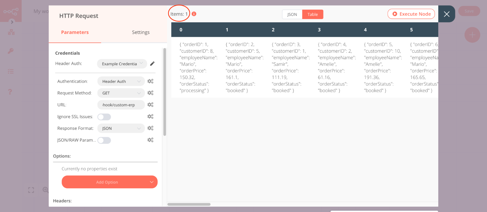
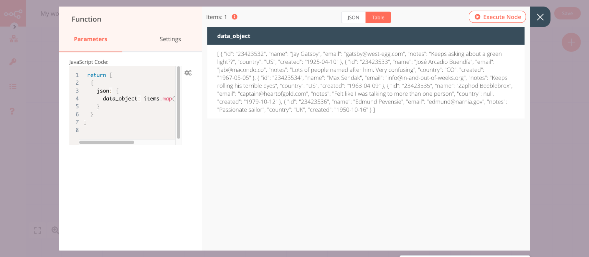
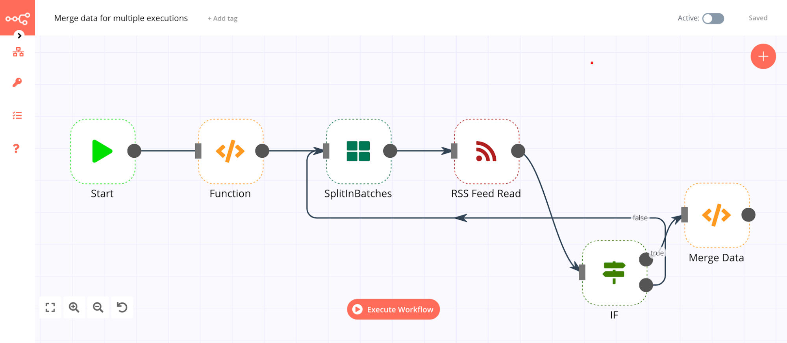

## Transforming Data

n8n uses a predefined [data structure](./README.md#data-structure) that allows all nodes to [process](./README.md#data-flow) incoming data correctly.

Your incoming data may have a different data structure, in which case you will need to transform it to allow each item to be processed individually.

For example, the image below shows the output of an [HTTP Request](../../nodes/nodes-library/core-nodes/HTTPRequest/README.md) node that returns data incompatible with n8n’s data structure. The node returns the data and displays that only one item was returned.

To transform this kind of structure into the n8n data structure you will have to use the [Function](../../nodes/nodes-library/core-nodes/Function/README.md) node. Refer to [Create multiple items from a single item](../../reference/javascript-code-snippets.md#_1-create-multiple-items-from-a-single-item) code snippet to transform the incoming data.

**Note**: If you’re using the HTTP Request node, you should use the Split Into items option to transform the data. You don’t have to use a Function node in that case.

## Merging items

You might want to merge items together in your workflows. For example when your data contains hundreds of items that you don't want to process individually. 

In such cases, merge all items into a single item and process just that one. Use this [code snippet](../../reference/javascript-code-snippets.html#_2-create-a-single-item-from-multiple-items) in the Function node to transform the data as shown below:

There are three different use cases for merging items:

* **Merge items of a single execution**: You can merge all incoming items into a single item, as explained in the above example. To merge items into a single item, refer to the JavaScript Code Snippets documentation. Please note that since you are merging different items into a single item the next node in the workflow will now process just that single item.
* **Merge items returned by different nodes**: If you want to merge items returned by different nodes, use the [Merge node](../../nodes/nodes-library/core-nodes/Merge/README.md).
* **Merge items of different executions**: You can also merge items that get returned in different executions. Refer to this [workflow](https://n8n.io/workflows/1160) to learn how:
    
    