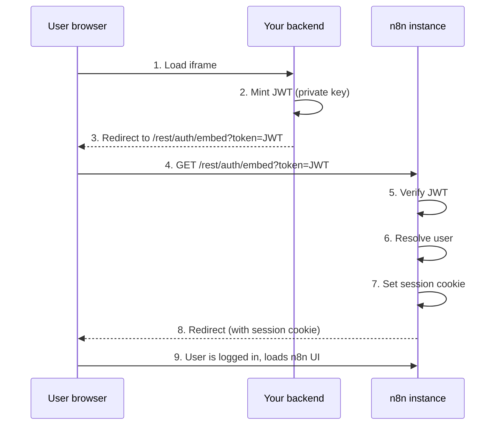
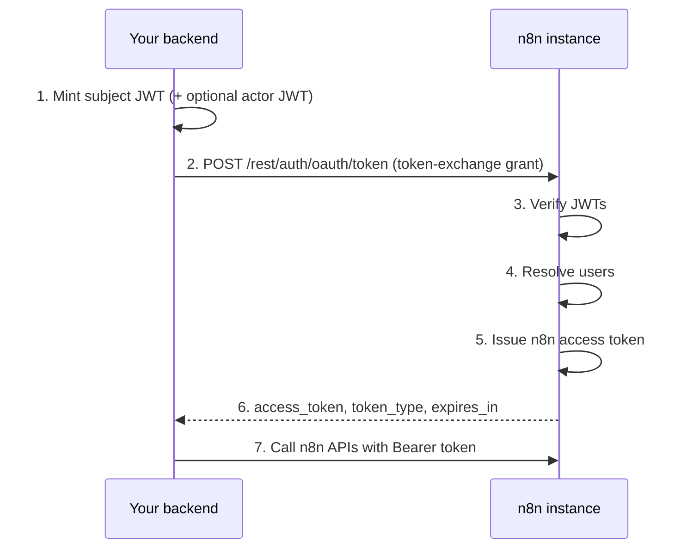

# Token exchange for embedding partners

--8<-- "_snippets/self-hosting/oem-agreement.md"

/// info | Feature availability
* Available on Enterprise plans.
* Enabled with the `N8N_ENV_FEAT_TOKEN_EXCHANGE` environment variable set to `true`. Self-hosted instances can set it directly. On Cloud, contact n8n support to request it.
* Intended for embedding partners who run an external identity provider (IdP) or backend that mints signed JWTs.
///

/// warning | Preview feature
Token exchange is in preview and gated by an environment flag. The environment variables, endpoint paths, and JWT claim contract can change before the feature reaches general availability. Pin your n8n version and retest your integration after each upgrade.
///

OAuth 2.0 Token Exchange ([RFC 8693](https://datatracker.ietf.org/doc/html/rfc8693){:target="_blank" .external-link}) lets embedding partners authenticate users and act on their behalf within an embedded n8n instance. Token exchange supports two use cases:

* **Iframe SSO**: Exchange an external JWT for an n8n session cookie, so users are logged in seamlessly when n8n is embedded in an iframe.
* **Delegated API access**: Exchange an external JWT for a scoped n8n access token to call n8n APIs on behalf of a user, for example to trigger workflows or manage credentials.

Both flows start the same way. Your backend mints a short-lived JWT signed with your private key. n8n verifies it using the registered public key, resolves the user, and returns either a session cookie or an access token.

## Before you begin

You need:

* An Enterprise license with the token exchange feature enabled.
* The beta feature flag set on your instance: `N8N_ENV_FEAT_TOKEN_EXCHANGE=true`.
* An RSA or EC key pair, or a JWKS endpoint that your IdP already publishes. See [Generate a key pair](#generate-a-key-pair).

## Generate a key pair

You need an asymmetric key pair. Your backend signs JWTs with the **private key**, and n8n verifies them with the **public key**.

=== "RSA (RS256)"

    ```bash
    # Generate a 2048-bit RSA private key
    openssl genrsa -out private.pem 2048

    # Extract the public key
    openssl rsa -in private.pem -pubout -out public.pem
    ```

=== "EC (ES256)"

    ```bash
    # Generate an EC private key using P-256
    openssl ecparam -name prime256v1 -genkey -noout -out private.pem

    # Extract the public key
    openssl ec -in private.pem -pubout -out public.pem
    ```

Keep `private.pem` secret in your backend. You register the contents of `public.pem` in n8n's trusted keys configuration.

If your IdP already publishes a JWKS endpoint, as most OAuth2 and OIDC providers do, you can skip key generation and point n8n at the JWKS URL instead. See [JWKS key source](#jwks-key-source).

## Environment variables

### Required

```bash
# Enable the beta module
N8N_ENV_FEAT_TOKEN_EXCHANGE=true

# Enable the token exchange endpoint (POST /rest/auth/oauth/token)
N8N_TOKEN_EXCHANGE_ENABLED=true

# Register your public key(s) - see Configure trusted keys
N8N_TOKEN_EXCHANGE_TRUSTED_KEYS='[{ ... }]'
```

To also enable the embed login endpoint (`GET` or `POST /rest/auth/embed`), set:

```bash
N8N_EMBED_LOGIN_ENABLED=true
```

/// note | File-based configuration
For large or multi-line JSON, store the value in a file and set `N8N_TOKEN_EXCHANGE_TRUSTED_KEYS_FILE=/path/to/trusted-keys.json` instead. n8n reads the file contents automatically.
///

### Optional tuning settings

These have sensible defaults and don't usually need to be changed:

| Variable | Default | Description |
| :------- | :------ | :---------- |
| `N8N_TOKEN_EXCHANGE_MAX_TOKEN_TTL` | `900` (15 min) | Maximum lifetime in seconds for issued n8n tokens. The actual expiry is the minimum of this value and the source token's remaining lifetime. |
| `N8N_TOKEN_EXCHANGE_KEY_REFRESH_INTERVAL_SECONDS` | `300` (5 min) | How often JWKS keys are refreshed (leader instance only). |
| `N8N_TOKEN_EXCHANGE_JTI_CLEANUP_INTERVAL_SECONDS` | `60` (1 min) | How often expired replay-protection records are cleaned up. |
| `N8N_TOKEN_EXCHANGE_JTI_CLEANUP_BATCH_SIZE` | `1000` | Maximum expired records deleted per cleanup run. |
| `N8N_TOKEN_EXCHANGE_EMBED_LOGIN_PER_MINUTE` | `20` | Rate limit for the embed login endpoint (requests per IP per minute). |
| `N8N_TOKEN_EXCHANGE_TOKEN_EXCHANGE_PER_MINUTE` | `20` | Rate limit for the token exchange endpoint (requests per IP per minute). |

## Configure trusted keys

The `N8N_TOKEN_EXCHANGE_TRUSTED_KEYS` environment variable accepts a JSON array of trusted key sources. Each entry tells n8n how to verify JWTs from your IdP.

There are two source types: `static` (an inline public key) and `jwks` (a remote JWKS endpoint). You can mix both types in the same array.

### Static key source

Use this when you generated your own key pair and want to embed the public key directly.

```json
{
	"type": "static",
	"kid": "my-key-1",
	"algorithms": ["RS256"],
	"key": "-----BEGIN PUBLIC KEY-----\nMIIBIjAN...contents-of-public.pem...\n-----END PUBLIC KEY-----",
	"issuer": "https://your-backend.example.com",
	"expectedAudience": "n8n",
	"allowedRoles": ["global:member", "global:admin"]
}
```

| Field | Required | Description |
| :---- | :------- | :---------- |
| `type` | Yes | Must be `"static"`. |
| `kid` | Yes | Key ID. Must match the `kid` header in incoming JWTs. |
| `algorithms` | Yes | Array of allowed signing algorithms, for example `["RS256"]`. See [Supported algorithms](#supported-algorithms). |
| `key` | Yes | PEM-encoded public key. Use `\n` for line breaks in JSON. |
| `issuer` | Yes | Expected `iss` claim in incoming JWTs. |
| `expectedAudience` | No | If set, the JWT `aud` claim must match this value. |
| `allowedRoles` | No | If set, only these roles can be assigned through the `role` claim. Tokens requesting other roles are rejected. |

### JWKS key source

Use this when your IdP publishes a JWKS endpoint.

```json
{
	"type": "jwks",
	"url": "https://idp.example.com/.well-known/jwks.json",
	"issuer": "https://idp.example.com",
	"expectedAudience": "n8n",
	"allowedRoles": ["global:member"]
}
```

| Field | Required | Description |
| :---- | :------- | :---------- |
| `type` | Yes | Must be `"jwks"`. |
| `url` | Yes | URL of the JWKS endpoint. |
| `issuer` | Yes | Expected `iss` claim in incoming JWTs. |
| `expectedAudience` | No | If set, the JWT `aud` claim must match this value. |
| `allowedRoles` | No | If set, only these roles can be assigned through the `role` claim. |
| `cacheTtlSeconds` | No | Override the JWKS cache duration. The default follows the endpoint's `Cache-Control` header, bounded between 60 and 86400 seconds. |

### Full example

```json
[
	{
		"type": "static",
		"kid": "my-static-key-1",
		"algorithms": ["RS256"],
		"key": "-----BEGIN PUBLIC KEY-----\nMIIBIjAN...your-key-here...\n-----END PUBLIC KEY-----",
		"issuer": "https://your-backend.example.com",
		"expectedAudience": "n8n",
		"allowedRoles": ["global:member", "global:admin"]
	},
	{
		"type": "jwks",
		"url": "https://idp.example.com/.well-known/jwks.json",
		"issuer": "https://idp.example.com"
	}
]
```

### Supported algorithms

Only asymmetric algorithms are accepted. HMAC and `none` are excluded.

| Family | Algorithms |
| :----- | :--------- |
| RSA | `RS256`, `RS384`, `RS512` |
| RSA-PSS | `PS256`, `PS384`, `PS512` |
| Elliptic Curve | `ES256`, `ES384`, `ES512` |
| Edwards Curve | `EdDSA` |

For static keys, the algorithms in the config must all belong to the same family and match the key type. For JWKS keys, n8n infers the algorithms from the JWK `alg` and `kty` or `crv` fields automatically.

## Required and optional JWT claims

### Required claims

Your IdP tokens must include these claims for n8n to accept them:

| Claim | Type | Description |
| :---- | :--- | :---------- |
| `sub` | string | Subject identifier. The unique user ID at the IdP. |
| `iss` | string (URL) | Issuer. Must match the `issuer` in your trusted key config. |
| `aud` | string or string array | Audience. Must match `expectedAudience` if configured. |
| `iat` | number | Issued-at timestamp (Unix epoch seconds). |
| `exp` | number | Expiration timestamp (Unix epoch seconds). |
| `jti` | string | Unique token ID. Each value can only be used once (replay protection). |

### Optional claims

| Claim | Type | Description |
| :---- | :--- | :---------- |
| `email` | string (valid email) | The user's email, used to match existing n8n users. Required if this is the user's first login (JIT provisioning). |
| `given_name` | string | First name, synced to the n8n user profile. |
| `family_name` | string | Last name, synced to the n8n user profile. |
| `role` | string | n8n role to assign, for example `global:member` or `global:admin`. See [User provisioning](#user-provisioning). |
| `nbf` | number | Not-before timestamp. |

## Iframe SSO flow

Use this flow when embedding n8n in an iframe. n8n logs the user in transparently with a session cookie.



### Step 1: Mint a JWT in your backend

Your backend creates a short-lived JWT signed with your private key.

```javascript
const jwt = require('jsonwebtoken');
const { randomUUID } = require('crypto');

const now = Math.floor(Date.now() / 1000);

const token = jwt.sign(
	{
		sub: 'user-id-in-your-system',          // unique user identifier
		iss: 'https://your-backend.example.com', // must match trusted key config
		aud: 'n8n',                             // must match expectedAudience (if set)
		iat: now,
		exp: now + 30,                          // short-lived: 30 seconds
		jti: randomUUID(),                      // unique per request
		email: 'user@example.com',              // required for first-time users
		given_name: 'Jane',                     // optional
		family_name: 'Doe',                     // optional
		role: 'global:member',                  // optional
	},
	privateKey,
	{ algorithm: 'RS256', header: { kid: 'my-key-1' } }
);
```

/// warning | Maximum 60-second lifetime
For the embed login flow, the JWT lifetime (`exp - iat`) must not exceed 60 seconds. n8n enforces this server-side.
///

### Step 2: Redirect the user

Send the user to the embed endpoint. You can optionally include a `redirectTo` path:

```text
GET https://your-n8n.example.com/rest/auth/embed?token=<JWT>&redirectTo=/workflow/abc123
```

There's also a `POST /rest/auth/embed` variant that accepts `token` and `redirectTo` in the request body.

### Step 3: n8n verifies and issues a session

n8n verifies the JWT signature, resolves or provisions the user (see [User provisioning](#user-provisioning)), sets a secure session cookie (`SameSite=None; Secure`), and redirects to the specified path.

## Delegated API access flow

Use this flow when your backend needs to call n8n APIs on behalf of a user, for example to trigger a workflow or manage credentials programmatically.

This flow supports an optional **actor token** for delegation. An actor, such as a service account or admin, acts on behalf of a subject, the end user. This enables audit attribution, so n8n records both who performed the action and on whose behalf.



### Step 1: Mint JWTs in your backend

Create a subject token representing the end user. The JWT can have a longer lifetime than the embed flow, bounded by `N8N_TOKEN_EXCHANGE_MAX_TOKEN_TTL` (default 15 minutes).

```javascript
const now = Math.floor(Date.now() / 1000);

const subjectToken = jwt.sign(
	{
		sub: 'end-user-id',
		iss: 'https://your-backend.example.com',
		aud: 'n8n',
		iat: now,
		exp: now + 900,                         // up to 15 minutes
		jti: randomUUID(),
		email: 'user@example.com',
		role: 'global:member',
	},
	privateKey,
	{ algorithm: 'RS256', header: { kid: 'my-key-1' } }
);
```

For delegation, also mint an actor token representing the service or admin performing the action:

```javascript
const actorToken = jwt.sign(
	{
		sub: 'service-account-id',
		iss: 'https://your-backend.example.com',
		aud: 'n8n',
		iat: now,
		exp: now + 900,
		jti: randomUUID(),
		email: 'service@example.com',
		role: 'global:admin',
	},
	privateKey,
	{ algorithm: 'RS256', header: { kid: 'my-key-1' } }
);
```

### Step 2: Exchange for an n8n access token

```bash
curl -X POST https://your-n8n.example.com/rest/auth/oauth/token \
	-H "Content-Type: application/x-www-form-urlencoded" \
	-d "grant_type=urn:ietf:params:oauth:grant-type:token-exchange" \
	-d "subject_token=<SUBJECT_JWT>" \
	-d "actor_token=<ACTOR_JWT>"
```

Request fields (`application/x-www-form-urlencoded`):

| Field | Required | Description |
| :---- | :------- | :---------- |
| `grant_type` | Yes | Must be `urn:ietf:params:oauth:grant-type:token-exchange`. |
| `subject_token` | Yes | JWT representing the end user. |
| `subject_token_type` | No | Token type identifier. |
| `actor_token` | No | JWT representing the actor (for delegation). |
| `actor_token_type` | No | Actor token type identifier. |
| `scope` | No | Requested scope (maximum 1024 characters). |
| `audience` | No | Intended audience (maximum 1024 characters). |
| `resource` | No | Target resource URIs, space-separated (maximum 2048 characters). |

Success response (`200 OK`):

```json
{
	"access_token": "<n8n JWT>",
	"token_type": "Bearer",
	"expires_in": 900,
	"issued_token_type": "urn:ietf:params:oauth:token-type:access_token"
}
```

### Step 3: Use the access token

Include the token in subsequent n8n API calls:

```bash
curl https://your-n8n.example.com/api/v1/workflows \
	-H "Authorization: Bearer <access_token>"
```

The token expires after `expires_in` seconds. Request a new one when it expires. Don't reuse the original external JWT, since each `jti` is single-use.

## User provisioning

When a token is exchanged, n8n resolves the external identity to an n8n user in this order:

1. **Known identity**: n8n looks up the `sub` claim in its identity store. If a previous exchange already linked this `sub` to an n8n user, that user is returned.
2. **Email fallback**: If the `sub` is unknown but the JWT contains an `email` claim, n8n searches for an existing user with that email. If found, the external identity is linked to that user going forward.
3. **Just-in-time (JIT) provisioning**: If neither match is found, n8n creates a new user automatically. The JWT must include an `email` claim for this to work. The new user is created with password login disabled, so they can only authenticate through token exchange.

### Role handling

| Scenario | Behavior |
| :------- | :------- |
| New user, no `role` claim | Assigned `global:member`. |
| New user, `role` claim present | Assigned the claimed role (must be valid and in `allowedRoles` if configured). |
| Existing user, no `role` claim | Role unchanged. |
| Existing user, `role` claim present | Role updated if different (must be valid and in `allowedRoles`). |
| Any user, `role` is `global:owner` | Rejected. The owner role can't be assigned or removed through token exchange. |
| Any user, role not in `allowedRoles` | Rejected with an error. |

### Profile sync

n8n syncs the `given_name` and `family_name` claims to the user profile on each login. It applies changes only when the values differ from what's stored.

## Security considerations

### Short-lived tokens

* External JWTs for the embed flow must have a lifetime of at most 60 seconds (`exp - iat <= 60`).
* For the token exchange flow, the issued n8n token expiry is the minimum of the source token's remaining lifetime, the actor token's remaining lifetime (if present), and `N8N_TOKEN_EXCHANGE_MAX_TOKEN_TTL` (default 900 seconds).
* Tokens within five seconds of expiry are rejected.

### Replay protection

Every external JWT must include a unique `jti` (JWT ID) claim. n8n records each `jti` and rejects any token whose `jti` has already been consumed. n8n cleans up expired `jti` records automatically.

### Asymmetric signatures only

n8n accepts only asymmetric algorithms (RSA, EC, EdDSA). It rejects HMAC algorithms such as `HS256` and `none` by design. This ensures that n8n never needs access to your signing secret.

### Scope constraints

The `allowedRoles` field on trusted key sources restricts which roles can be assigned through token exchange. Use it to enforce least privilege, for example to restrict an embedding integration to provisioning only `global:member` users.

### Audit attribution

n8n emits audit events for all token exchange activity:

| Event | When |
| :---- | :--- |
| `token-exchange-succeeded` | Successful token exchange. |
| `token-exchange-failed` | Failed token exchange (with failure reason). |
| `embed-login` | Successful embed login. |
| `token-exchange-user-provisioned` | New user created through JIT provisioning. |
| `token-exchange-identity-linked` | Existing user linked to a new external identity. |
| `token-exchange-role-updated` | User role changed through token exchange. |

When you use the actor token flow, n8n records both the subject (on whose behalf) and the actor (who performed the action), enabling full attribution in audit logs.

## Troubleshooting

| Symptom | Likely cause |
| :------ | :----------- |
| `501 - Token exchange is not enabled` | `N8N_TOKEN_EXCHANGE_ENABLED` isn't `true`, or the beta flag `N8N_ENV_FEAT_TOKEN_EXCHANGE` is missing. |
| `501 - Embed login is not enabled` | `N8N_EMBED_LOGIN_ENABLED` isn't `true`. |
| `400 - unsupported_grant_type` | The `grant_type` field is missing or not exactly `urn:ietf:params:oauth:grant-type:token-exchange`. |
| `400 - invalid_grant` | JWT signature verification failed. Check that the `kid` and `iss` in the JWT match your trusted key config, and that the public key or JWKS URL is correct. |
| `400 - Token claims validation failed` | The JWT is missing a required claim (`sub`, `iss`, `aud`, `iat`, `exp`, `jti`), or a claim has the wrong type. |
| `400 - Token header missing kid` | The JWT header doesn't contain a `kid` field. Make sure your signing code sets it. |
| `400 - Token lifetime exceeds maximum allowed` | Embed login tokens must have `exp - iat <= 60` seconds. |
| `400 - Token has already been used` | The `jti` was already consumed. Generate a unique `jti`, such as a UUID, for every token. |
| `400 - Subject token too close to expiry` | The source token has fewer than five seconds of remaining lifetime. |
| User not created on first login | The JWT is missing the `email` claim, which is required for JIT provisioning. |
| Role not applied | The `role` claim value isn't in the `allowedRoles` list configured on the trusted key source, or is an unrecognized role. |

## Related resources

* [OEM deployment overview](/hosting/oem-deployment/index.md): embed and surface n8n's interface inside your product.
* [Set up SSO](/hosting/securing/set-up-sso.md): organization-wide single sign-on through SAML or OIDC.
* [HTTP Request credentials: Using OAuth2](/integrations/builtin/credentials/httprequest.md#using-oauth2): set up a generic OAuth 2.0 credential.
* [OAuth 2.0 Token Exchange (RFC 8693)](https://datatracker.ietf.org/doc/html/rfc8693){:target="_blank" .external-link}: the token exchange specification.
