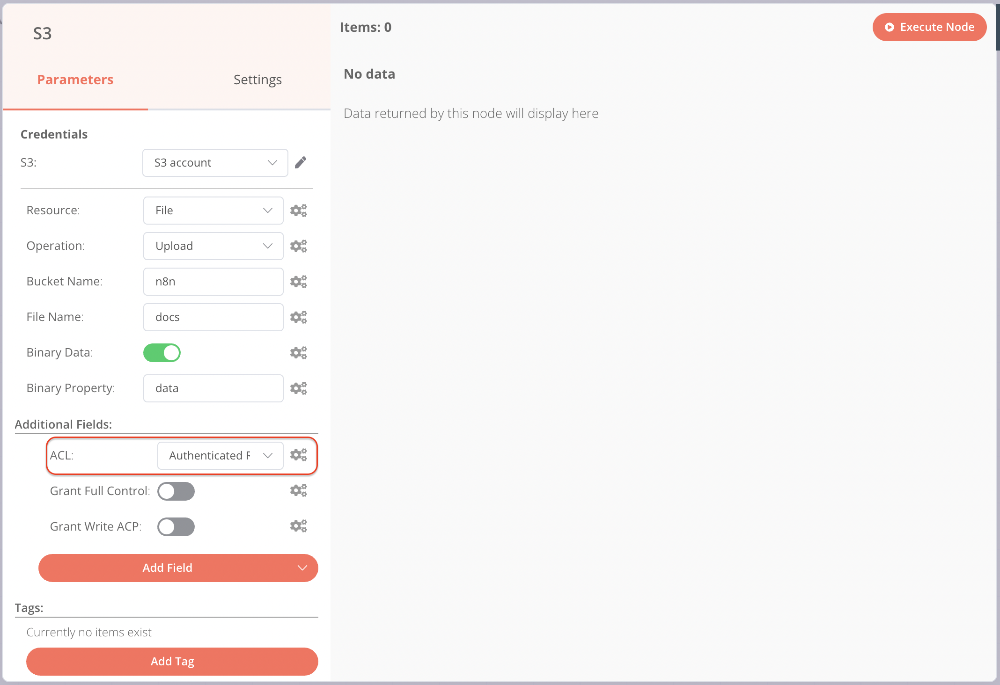

# S3

Use the S3 node to automate work in non-AWS S3 storage and integrate S3 with other applications. n8n has built-in support for a wide range of S3 features, including creating, deleting, and getting buckets, files, and folders. For AWS S3, use [AWS S3](n8n-nodes-base.awss3.md).

Use the S3 node for non-AWS S3 solutions like:

* [MinIO](https://min.io/)
* [Wasabi](https://wasabi.com/)
* [Digital Ocean spaces](https://www.digitalocean.com/products/spaces)

On this page, you'll find a list of operations the S3 node supports and links to more resources.


**Credentials**

Refer to [S3 credentials](../credentials/s3.md) for guidance on setting up authentication.




## Operations 

* Bucket
  * Create a bucket
  * Delete a bucket
  * Get all buckets
  * Search within a bucket
*   File 

    * Copy a file
    * Delete a file
    * Download a file
    * Get all files
    * Upload a file

    

<strong>Attach file for upload</strong>

To attach a file for upload, use another node to pass the file as a data property. Nodes like the <a href="../core-nodes/n8n-nodes-base.readwritefile.md">Read/Write Files from Disk</a> node or the <a href="../core-nodes/n8n-nodes-base.httprequest/">HTTP Request</a> work well.

* Folder
  * Create a folder
  * Delete a folder
  * Get all folders

## Templates and examples 

[Browse S3 node documentation integration templates](https://n8n.io/integrations/s3) or [search all templates](https://n8n.io/workflows/)

## Node reference 

### Setting file permissions in Wasabi 

When uploading files to [Wasabi](https://wasabi.com/), you must set permissions for the files using the **ACL** dropdown and not the toggles.

