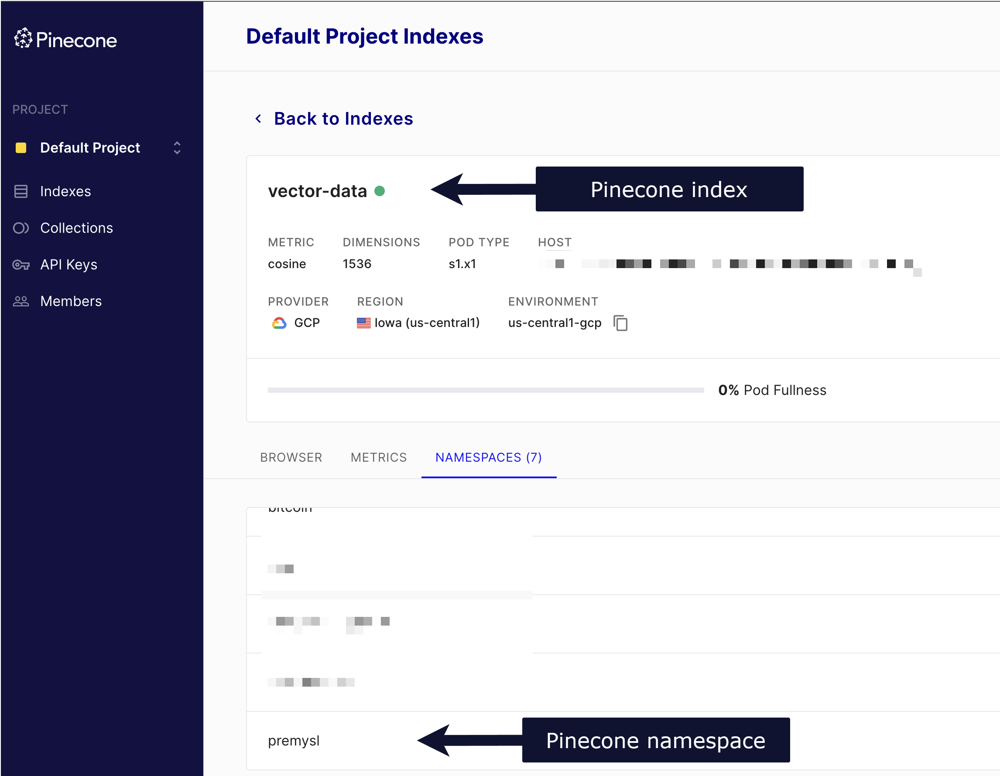

# Pinecone Vector Store

Use the Pinecone node to interact with your Pinecone database as [vector store](https://app.gitbook.com/s/CxSeOtVxqqhfxMSac0AV/key-concept-glossary#ai-vector-store). You can insert documents into a vector database, get documents from a vector database, retrieve documents to provide them to a retriever connected to a [chain](https://app.gitbook.com/s/CxSeOtVxqqhfxMSac0AV/key-concept-glossary#ai-chain), or connect directly to an [agent](https://app.gitbook.com/s/CxSeOtVxqqhfxMSac0AV/key-concept-glossary#ai-agent) as a [tool](https://app.gitbook.com/s/CxSeOtVxqqhfxMSac0AV/key-concept-glossary#ai-tool). You can also update an item in a vector database by its ID.

On this page, you'll find the node parameters for the Pinecone node, and links to more resources.


**Credentials**

You can find authentication information for this node [here](../../credentials/pinecone.md).




## Node usage patterns 

You can use the Pinecone Vector Store node in the following patterns.

### Use as a regular node to insert, update, and retrieve documents 

You can use the Pinecone Vector Store as a regular node to insert, update, or get documents. This pattern places the Pinecone Vector Store in the regular connection flow without using an agent.

You can see an example of this in scenario 1 of [this template](https://n8n.io/workflows/2165-chat-with-pdf-docs-using-ai-quoting-sources/).

### Connect directly to an AI agent as a tool 

You can connect the Pinecone Vector Store node directly to the tool connector of an [AI agent](n8n-nodes-langchain.agent/) to use a vector store as a resource when answering queries.

Here, the connection would be: AI agent (tools connector) -> Pinecone Vector Store node.

### Use a retriever to fetch documents 

You can use the [Vector Store Retriever](../sub-nodes/n8n-nodes-langchain.retrievervectorstore.md) node with the Pinecone Vector Store node to fetch documents from the Pinecone Vector Store node. This is often used with the [Question and Answer Chain](n8n-nodes-langchain.chainretrievalqa/) node to fetch documents from the vector store that match the given chat input.

An [example of the connection flow](https://n8n.io/workflows/1960-ask-questions-about-a-pdf-using-ai/) would be: Question and Answer Chain (Retriever connector) -> Vector Store Retriever (Vector Store connector) -> Pinecone Vector Store.

### Use the Vector Store Question Answer Tool to answer questions 

Another pattern uses the [Vector Store Question Answer Tool](../sub-nodes/n8n-nodes-langchain.toolvectorstore.md) to summarize results and answer questions from the Pinecone Vector Store node. Rather than connecting the Pinecone Vector Store directly as a tool, this pattern uses a tool specifically designed to summarizes data in the vector store.

The [connections flow](https://n8n.io/workflows/2705-chat-with-github-api-documentation-rag-powered-chatbot-with-pinecone-and-openai/) in this case would look like this: AI agent (tools connector) -> Vector Store Question Answer Tool (Vector Store connector) -> Pinecone Vector store.

## Node parameters 

### Operation Mode 



### Rerank Results 



### Get Many parameters 

* **Pinecone Index**: Select or enter the Pinecone Index to use.
* **Prompt**: Enter your search query.
* **Limit**: Enter how many results to retrieve from the vector store. For example, set this to `10` to get the ten best results.

### Insert Documents parameters 

* **Pinecone Index**: Select or enter the Pinecone Index to use.

### Retrieve Documents (As Vector Store for Chain/Tool) parameters 

* **Pinecone Index**: Select or enter the Pinecone Index to use.

### Retrieve Documents (As Tool for AI Agent) parameters 

* **Name**: The name of the vector store.
* **Description**: Explain to the LLM what this tool does. A good, specific description allows LLMs to produce expected results more often.
* **Pinecone Index**: Select or enter the Pinecone Index to use.
* **Limit**: Enter how many results to retrieve from the vector store. For example, set this to `10` to get the ten best results.

### Parameters for **Update Documents** 

* ID

## Node options 

### Pinecone Namespace 

Another segregation option for how to store your data within the index.

### Metadata Filter 



### Clear Namespace 

Available in **Insert Documents** mode. Deletes all data from the namespace before inserting the new data.

## Templates and examples 

[Browse Pinecone Vector Store node documentation integration templates](https://n8n.io/integrations/pinecone-vector-store) or [search all templates](https://n8n.io/workflows/)

## Related resources 

Refer to [LangChain's Pinecone documentation](https://js.langchain.com/docs/integrations/vectorstores/pinecone/) for more information about the service.



### Find your Pinecone index and namespace 

Your Pinecone index and namespace are available in your Pinecone account.

