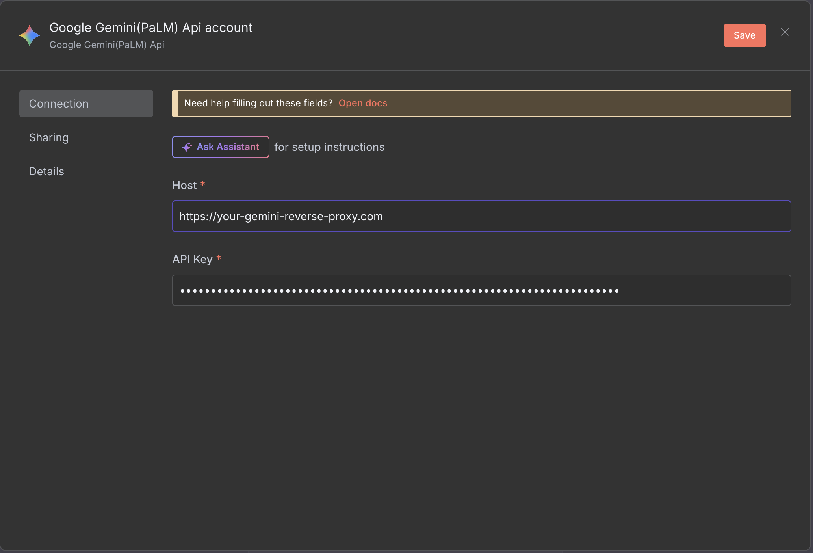

# Google Gemini Chat Model node 

Use the Google Gemini Chat Model node to use Google's Gemini chat models with conversational agents.

On this page, you'll find the node parameters for the Google Gemini Chat Model node, and links to more resources.


**Credentials**

You can find authentication information for this node [here](../../credentials/googleai.md).




## Node parameters 

* **Model**: Select the model to use to generate the completion.

n8n dynamically loads models from the Google Gemini API and you'll only see the models available to your account.

## Node options 

* **Maximum Number of Tokens**: Enter the maximum number of tokens used, which sets the completion length.
* **Sampling Temperature**: Use this option to control the randomness of the sampling process. A higher temperature creates more diverse sampling, but increases the risk of hallucinations.
* **Top K**: Enter the number of token choices the model uses to generate the next token.
* **Top P**: Use this option to set the probability the completion should use. Use a lower value to ignore less probable options. 
* **Safety Settings**: Gemini supports adjustable safety settings. Refer to Google's [Gemini API safety settings](https://ai.google.dev/docs/safety_setting_gemini) for information on the available filters and levels.

## Limitations 

### No proxy support 

The Google Gemini Chat Model node uses Google's SDK, which doesn't support proxy configuration.

If you need to proxy your connection, as a work around, you can set up a dedicated reverse proxy for Gemini requests and change the **Host** parameter in your [Google Gemini credentials](../../credentials/googleai.md) to point to your proxy address:

## Templates and examples 

[Browse Google Gemini Chat Model node documentation integration templates](https://n8n.io/integrations/google-gemini-chat-model) or [search all templates](https://n8n.io/workflows/)

## Related resources 

Refer to [LangChain's Google Gemini documentation](https://js.langchain.com/docs/integrations/chat/google_generativeai) for more information about the service.



