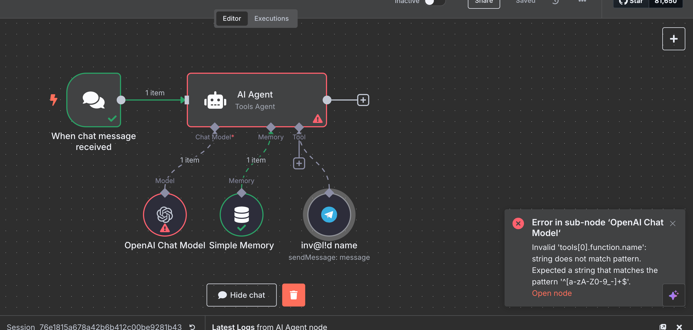

# Vector Store Question Answer Tool node 

The Vector Store Question Answer node is a tool[^1] that allows an agent[^2] to summarize results and answer questions based on chunks from a [vector store](#user-content-fn-3)[^3]. 

On this page, you'll find the node parameters for the Vector Store Question Answer node, and links to more resources.


**Examples and templates**

For usage examples and templates to help you get started, refer to n8n's [Vector Store Question Answer Tool integrations](https://n8n.io/integrations/vector-store-tool/) page.




## Node parameters 

### Description of Data 

Enter a description of the data in the vector store.

### Limit 

The maximum number of results to return.

## How n8n populates the tool description 

n8n uses the node name (select the name to edit) and **Description of Data** parameter to populate the tool description for AI agents using the following format:

> Useful for when you need to answer questions about [node name]. Whenever you need information about [Description of Data], you should ALWAYS use this. Input should be a fully formed question.

Spaces in the node name are converted to underscores in the tool description.


**Avoid special characters in node names**

Using special characters in the node name will cause errors when the agent runs:

Use only alphanumeric characters, spaces, dashes, and underscores in node names.


## Related resources 

View [example workflows and related content](https://n8n.io/integrations/vector-store-tool/) on n8n's website.





[^1]: In an AI context, a tool is an add-on resource that the AI can refer to for specific information or functionality when responding to a request. The AI model can use a tool to interact with external systems or complete specific, focused tasks.
[^2]: AI agents are artificial intelligence systems capable of responding to requests, making decisions, and performing real-world tasks for users. They use large language models (LLMs) to interpret user input and make decisions about how to best process requests using the information and resources they have available.
[^3]: A vector store, or vector database, stores mathematical representations of information. Use with embeddings and retrievers to create a database that your AI can access when answering questions.
