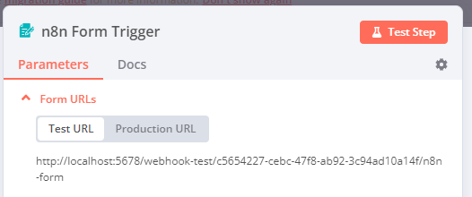

# n8n Form Trigger node <a href="#n8n-form-trigger-node" id="n8n-form-trigger-node"></a>

Use the n8n Form trigger to start a workflow when a user submits a form, taking the input data from the form. The node generates the form web page for you to use.

You can add more pages to continue the form with the [n8n Form](n8n-nodes-base.form.md) node.

## Build and test workflows <a href="#build-and-test-workflows" id="build-and-test-workflows"></a>

While building or testing a workflow, use the **Test URL**. Using a test URL ensures that you can view the incoming data in the editor UI, which is useful for debugging. 

There are two ways to test:

- Select **Execute Step**. n8n opens the form. When you submit the form, n8n runs the node, but not the rest of the workflow.
- Select **Execute Workflow**. n8n opens the form. When you submit the form, n8n runs the workflow.

## Production workflows <a href="#production-workflows" id="production-workflows"></a>

When your workflow is ready, switch to using the **Production URL**. You can then publish your workflow, and n8n runs it automatically when a user submits the form.

When working with a production URL, ensure that you have saved and published the workflow. Data flowing through the Form trigger isn't visible in the editor UI with the production URL.

## Set default selections with query parameters <a href="#set-default-selections-with-query-parameters" id="set-default-selections-with-query-parameters"></a>

You can set the initial values for fields by using [query parameters](https://en.wikipedia.org/wiki/Query_string#Web_forms) with the initial URL provided by the n8n Form Trigger. Every [page in the form](n8n-nodes-base.form.md) receives the same query parameters sent to the n8n Form Trigger URL.


**Only for production**

Query parameters are only available when using the form in production mode. n8n won't populate field values from query parameters in testing mode.



When using query parameters, [percent-encode](https://en.wikipedia.org/wiki/Percent-encoding) any field names or values that use special characters. This ensures n8n uses the initial values for the given fields. You can use tools like [URL Encode/Decode](https://www.url-encode-decode.com/) to format your query parameters using percent-encoding.

As an example, imagine you have a form with the following properties:

* Production URL: `https://my-account.n8n.cloud/form/my-form`
* Fields:
	* `name`: `Jane Doe`
	* `email`: `jane.doe@example.com`

With query parameters and percent-encoding, you could use the following URL to set initial field values to the data above:

```
https://my-account.n8n.cloud/form/my-form?email=jane.doe%40example.com&name=Jane%20Doe
```

Here, percent-encoding replaces the at-symbol (`@`) with the string `%40` and the space character (` `) with the string `%20`. This will set the initial value for these fields no matter which page of the form they appear on.


## Node parameters <a href="#node-parameters" id="node-parameters"></a>

These are the main node configuration fields:

### Authentication <a href="#authentication" id="authentication"></a>

- **Basic Auth**
- **None**

#### Using basic auth <a href="#using-basic-auth" id="using-basic-auth"></a>

To configure this credential, you'll need:

- The **Username** you use to access the app or service your HTTP Request is targeting.
- The **Password** that goes with that username.

### Form URLs <a href="#form-urls" id="form-urls"></a>

The Form Trigger node has two URLs: **Test URL** and **Production URL**. n8n displays the URLs at the top of the node panel. Select **Test URL** or **Production URL** to toggle which URL n8n displays.



- **Test URL**: n8n registers a test webhook when you select **Execute Step** or **Execute Workflow**, if the workflow isn't active. When you call the URL, n8n displays the data in the workflow.
- **Production URL**: n8n registers a production webhook when you publish the workflow. When using the production URL, n8n doesn't display the data in the workflow. You can still view workflow data for a production execution. Select the **Executions** tab in the workflow, then select the workflow execution you want to view.

### Form Path <a href="#form-path" id="form-path"></a>

Set a custom slug for the form.

### Form Title <a href="#form-title" id="form-title"></a>

Enter the title for your form. n8n displays the **Form Title** as the webpage title and main `h1` title on the form.

### Form Description <a href="#form-description" id="form-description"></a>

Enter the description for your form. n8n displays the **Form Description** as a subtitle below the main `h1` title on the form. Use `\n` or `<br>` to add a line break.

For information on allowed and restricted HTML tags, see [HTML security and allowed tags](#html-security-and-allowed-tags).

### Form Elements <a href="#form-elements" id="form-elements"></a>

Create the question fields for your form. Select **Add Form Element** to add a new field.

Every field has the following settings:

- **Field Label**: Enter the label that appears above the input field on the rendered form. 
- **Field Name**: This name is used in the output of the Form Trigger node. Use it to reference a form field in downstream nodes.
- **Element Type**: Choose from **Checkboxes**, **Custom HTML**, **Date**, **Dropdown**, **Email**, **File**, **Hidden Field**, **Number**, **Password**, **Radio Buttons**, **Text**, or **Textarea**.
	- Select **Checkboxes** to include checkbox elements in the form. By default, there is no limit on how many checkboxes a form user can select. You can set the limit by specifying a value for the **Limit Selection** option as **Exact Number**, **Range**, or **Unlimited**.
	- Select **Custom HTML** to insert arbitrary HTML.
		- You can include elements like links, images, video, and more. You can't include `<script>`, `<style>`, or `<input>` elements. For more information, see [HTML security and allowed tags](#html-security-and-allowed-tags).
		- By default, Custom HTML fields aren't included in the node output. To include the Custom HTML content in the output, fill out the associated **Element Name** field.
    - Select **Date** to include a date picker in the form. Refer to [Date and time with Luxon](https://app.gitbook.com/s/rPN1zU5jaYNvwH7RzxqA/work-with-data/handle-special-data-types/work-with-dates-and-times) for more information on formatting dates.
	- Select **Dropdown List** > **Add Field Option** to add multiple options. By default, the dropdown is single-choice. To make it multiple-choice, turn on **Multiple Choice**.
	- Select **Radio Buttons** to include radio button elements in the form.
	- Select **Hidden Field** to include a form element without displaying it on the form. You can set a default value using the **Field Value** parameter or pass values for the field using [query parameters](#set-default-selections-with-query-parameters).
- **Placeholder**: Define a sample text to display inside compatible form elements. Placeholders are supported in **Email**, **Number**, **Password**, **Text** and **Textarea**.
- **Default value**: Define a default value that will be pre-filled or pre-selected in compatible form elements. Default values are supported in all form elements except **Custom HTML**, **File**, **Hidden Field**, and **Password**.
- **Required Field**: Turn on to require users to complete this field on the form. 

### Respond When <a href="#respond-when" id="respond-when"></a>

Choose when n8n sends a response to the form submission. You can respond when:

- **Form Is Submitted**: Send a response to the user as soon as they submit the form.
- **Workflow Finishes**: Use this if you want the workflow to complete its execution before you send a response to the user. If the workflow errors, it sends a response to the user telling them there was a problem submitting the form.

## Node options <a href="#node-options" id="node-options"></a>

Select **Add Option** to view more configuration options: 

- **Append n8n Attribution**: Turn off to hide the **Form automated with n8n** attribute at the bottom of the form.
- **Button Label**: The label to use for your form's submit button. n8n displays the **Button Label** as the name of the submit button.
- **Form Path**: The final segment of the form's URL, for both testing and production. Replaces the automatically generated UUID as the final component.
- **Ignore Bots**: Turn on to ignore requests from bots like link previewers and web crawlers. 
- **Use Workflow Timezone**: Turn on to use the timezone in the [Workflow settings](https://app.gitbook.com/s/rPN1zU5jaYNvwH7RzxqA/manage-workflows/configure-workflow-settings) instead of UTC (default). This affects the value of the `submittedAt` timestamp in the node output. 
- **Custom Form Styling**: Override the default styling of the public form interface with CSS. The field pre-populates with the default styling so you can change only what you need to.

## Customizing Form Trigger node behavior <a href="#customizing-form-trigger-node-behavior" id="customizing-form-trigger-node-behavior"></a>

### Format response text with line breaks <a href="#format-response-text-with-line-breaks" id="format-response-text-with-line-breaks"></a>

You can use one of the following methods to add line breaks to form response text:

• Use HTML formatting instead of plain text in the formSubmittedText field
• Replace newline characters (`\n`) with HTML break tags (`<br>`) before sending the response
• Consider using a custom HTML response page if you need more formatting control

### Restrict form access with authentication <a href="#restrict-form-access-with-authentication" id="restrict-form-access-with-authentication"></a>

You can use one of the following options to add authentication to your form:

• Use the OTP (One-Time Password) field with TOTP node validation for token-based authentication
• Add a Wait node with form authentication as a secondary form page
• Store hashed passwords in a database and compare against form submissions for validation
• Use external authentication providers like Google Forms if you need advanced authentication

## HTML security and allowed tags <a href="#html-security-and-allowed-tags" id="html-security-and-allowed-tags"></a>

The n8n Form Trigger automatically sanitizes HTML content in the **Form Description** field and **Custom HTML** form elements to prevent security vulnerabilities. While HTML is supported for formatting, certain tags and attributes are restricted.

### Allowed HTML Tags <a href="#allowed-html-tags" id="allowed-html-tags"></a>

You can use the following tags for formatting: `<a>`, `<b>`, `<br>`, `<code>`, `<div>`, `<em>`, `<h1>` through `<h6>`, `<i>`, `<iframe>`, ``, `<li>`, `<ol>`, `<p>`, `<pre>`, `<span>`, `<strong>`, `<sub>`, `<sup>`, `<table>`, `<tbody>`, `<td>`, `<tfoot>`, `<th>`, `<thead>`, `<tr>`, `<u>`, `<ul>`, `<video>`, and `<source>`.

### Restricted Tags <a href="#restricted-tags" id="restricted-tags"></a>

The following tags are automatically removed for security: `<script>`, `<style>`, `<input>`, `<form>`, `<button>`, and other potentially dangerous elements that could enable XSS attacks or interfere with form functionality.

### Attribute Restrictions <a href="#attribute-restrictions" id="attribute-restrictions"></a>

Only specific attributes are allowed on certain tags:

* Links (`<a>`): `href`, `target`, `rel`
* Images (``): `src`, `alt`, `width`, `height`
* Videos (`<video>`): `controls`, `autoplay`, `loop`, `muted`, `poster`, `width`, `height`
* Iframes (`<iframe>`): `src`, `width`, `height`, `frameborder`, `allow`, `allowfullscreen`, `referrerpolicy` (automatically sandboxed)
* Table cells (`<td>`, `<th>`): `colspan`, `rowspan`, `scope`, `headers`

All other attributes are removed during sanitization. Only `http://` and `https://` URL schemes are permitted.

## Templates and examples <a href="#templates-and-examples" id="templates-and-examples"></a>


[Browse n8n Form Trigger node documentation integration templates](https://n8n.io/integrations/n8n-form-trigger) or [search all templates](https://n8n.io/workflows/)
