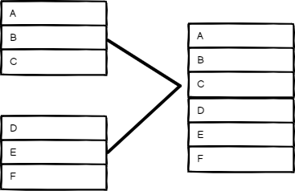
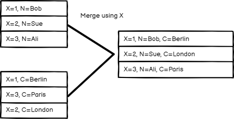
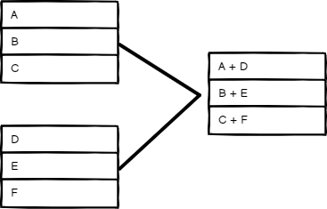
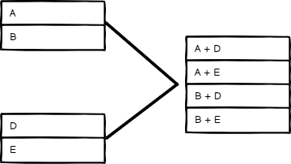

# Merge <a href="#merge" id="merge"></a>

Use the Merge node to combine data from multiple streams, once data of all streams is available.


**Major changes in 0.194.0**

The n8n team overhauled this node in n8n 0.194.0. This document reflects the latest version of the node. If you're using an older version of n8n, you can find the previous version of this document [here](https://github.com/n8n-io/n8n-docs/blob/4ff688642cc9ee7ca7d00987847bf4e4515da59d/docs/integrations/builtin/core-nodes/n8n-nodes-base.merge.md).



**Minor changes in 1.49.0**

n8n version 1.49.0 introduced the option to add more than two inputs. Older versions only support up to two inputs. If you're running an older version and want to combine multiple inputs in these versions, use the [Code node](https://deploy-preview-2225--n8n-docs.netlify.app/code/code-node/).

The **Mode > SQL Query** feature was also added in n8n version 1.49.0 and isn't available in older versions.


## Node parameters <a href="#node-parameters" id="node-parameters"></a>

You can specify how the Merge node should combine data from different data streams by choosing a **Mode**: 

### Append <a href="#append" id="append"></a>

Keep data from all inputs. Choose a **Number of Inputs** to output items of each input, one after another. The node waits for the execution of all connected inputs. 

<figure>

<figcaption>Append mode inputs and output</figcaption>
</figure>

### Combine <a href="#combine" id="combine"></a>

Combine data from two inputs. Select an option in **Combine By** to determine how you want to merge the input data.

#### Matching Fields <a href="#matching-fields" id="matching-fields"></a>

Compare items by field values. Enter the fields you want to compare in **Fields to Match**. 

n8n's default behavior is to keep matching items. You can change this using the **Output Type** setting:

* **Keep Matches**: Merge items that match. This is like an inner join.
* **Keep Non-Matches**: Merge items that don't match.
* **Keep Everything**: Merge items together that do match and include items that don't match. This is like an outer join.
* **Enrich Input 1**: Keep all data from Input 1, and add matching data from Input 2. This is like a left join.
* **Enrich Input 2**: Keep all data from Input 2, and add matching data from Input 1. This is like a right join.

<figure>

<figcaption>Combine by Matching Fields mode inputs and output</figcaption>
</figure>


#### Position <a href="#position" id="position"></a>

Combine items based on their order. The item at index 0 in Input 1 merges with the item at index 0 in Input 2, and so on.

<figure>

<figcaption>Combine by Position mode inputs and output</figcaption>
</figure>


#### All Possible Combinations <a href="#all-possible-combinations" id="all-possible-combinations"></a>

Output all possible item combinations, while merging fields with the same name.

<figure>

<figcaption>Combine by All Possible Combinations mode inputs and output</figcaption>
</figure>

#### Combine mode options <a href="#combine-mode-options" id="combine-mode-options"></a>

When merging data by **Mode > Combine**, you can set these **Options**:

* **Clash Handling**: Choose how to merge when data streams clash, or when there are sub-fields. Refer to [Clash handling](#clash-handling) for details.
* **Fuzzy Compare**: Whether to tolerate type differences when comparing fields (enabled), or not (disabled, default). For example, when you enable this, n8n treats `"3"` and `3` as the same.
* **Disable Dot Notation**: This prevents accessing child fields using `parent.child` in the field name.
* **Multiple Matches**: Choose how n8n handles multiple matches when comparing data streams.
    * **Include All Matches**: Output multiple items if there are multiple matches, one for each match.
    * **Include First Match Only**: Keep the first item per match and discard the remaining multiple matches.
* **Include Any Unpaired Items**: Choose whether to keep or discard unpaired items when merging by position. The default behavior is to leave out the items without a match. 

##### Clash Handling <a href="#clash-handling" id="clash-handling"></a>



### SQL Query <a href="#sql-query" id="sql-query"></a>

Write a custom SQL Query to merge the data. 

Example: 
```sql
SELECT * FROM input1 LEFT JOIN input2 ON input1.name = input2.id
```

Data from previous nodes are available as tables and you can use them in the SQL query as input1, input2, input3, and so on, based on their order. Refer to [AlaSQL GitHub page](https://github.com/alasql/alasql/wiki/Supported-SQL-statements) for a full list of supported SQL statements. 

### Choose Branch <a href="#choose-branch" id="choose-branch"></a>

Choose which input to keep. This option always waits until the data from both inputs is available. You can choose to **Output**:

* The **Input 1 Data**
* The **Input 2 Data**
* **A Single, Empty Item**

The node outputs the data from the chosen input, without changing it.

## Templates and examples <a href="#templates-and-examples" id="templates-and-examples"></a>


[Browse Merge integration templates](https://n8n.io/integrations/merge) or [search all templates](https://n8n.io/workflows/)

## Merging data streams with uneven numbers of items <a href="#merging-data-streams-with-uneven-numbers-of-items" id="merging-data-streams-with-uneven-numbers-of-items"></a>

The items passed into Input 1 of the Merge node will take precedence. For example, if the Merge node receives five items in Input 1 and 10 items in Input 2, it only processes five items. The remaining five items from Input 2 aren't processed.

## Branch execution with If and Merge nodes <a href="#branch-execution-with-if-and-merge-nodes" id="branch-execution-with-if-and-merge-nodes"></a>




## Try it out: A step by step example <a href="#try-it-out-a-step-by-step-example" id="try-it-out-a-step-by-step-example"></a>

Create a workflow with some example input data to try out the Merge node.

### Set up sample data using the Code nodes <a href="#set-up-sample-data-using-the-code-nodes" id="set-up-sample-data-using-the-code-nodes"></a>

1. Add a Code node to the canvas and connect it to the Start node.
2. Paste the following JavaScript code snippet in the **JavaScript Code** field:
```js
return [
  {
    json: {
      name: 'Stefan',
      language: 'de',
    }
  },
  {
    json: {
      name: 'Jim',
      language: 'en',
    }
  },
  {
    json: {
      name: 'Hans',
      language: 'de',
    }
  }
];
```
3. Add a second Code node, and connect it to the Start node.
4. Paste the following JavaScript code snippet in the **JavaScript Code** field:
```js
return [
	  {
    json: {
      greeting: 'Hello',
      language: 'en',
    }
  },
  {
    json: {
      greeting: 'Hallo',
      language: 'de',
    }
  }
];
```

### Try out different merge modes <a href="#try-out-different-merge-modes" id="try-out-different-merge-modes"></a>

Add the Merge node. Connect the first Code node to **Input 1**, and the second Code node to **Input 2**. Run the workflow to load data into the Merge node.

The final workflow should look like this:



Now try different options in **Mode** to see how it affects the output data.

#### Append <a href="#append" id="append"></a>

Select **Mode** > **Append**, then select **Execute step**.

Your output in table view should look like this:

| **name** | **language** | **greeting** |
| --- | --- | --- |
| Stefan | de |  |
| Jim | en |  |
| Hans | de |  |
|   | en | Hello |
|   | de | Hallo |


#### Combine by Matching Fields <a href="#combine-by-matching-fields" id="combine-by-matching-fields"></a>

You can merge these two data inputs so that each person gets the correct greeting for their language.

1. Select **Mode** > **Combine**.
2. Select **Combine by** > **Matching Fields**.
3. In both **Input 1 Field** and **Input 2 Field**, enter `language`. This tells n8n to combine the data by matching the values in the `language` field in each data set.
4. Select **Execute step**.

Your output in table view should look like this:


| **name** | **language** | **greeting** |
| --- | --- | --- |
| Stefan | de | Hallo |
| Jim | en | Hello  |
| Hans | de | Hallo |


#### Combine by Position <a href="#combine-by-position" id="combine-by-position"></a>

Select **Mode** > **Combine**, **Combine by** > **Position**, then select **Execute step**.

Your output in table view should look like this:

| **name** | **language** | **greeting** |
| --- | --- | --- |
| Stefan | en | Hello |
| Jim | de | Hallo  |


##### Keep unpaired items <a href="#keep-unpaired-items" id="keep-unpaired-items"></a>

If you want to keep all items, select **Add Option** > **Include Any Unpaired Items**, then turn on **Include Any Unpaired Items**.

Your output in table view should look like this:

| **name** | **language** | **greeting** |
| --- | --- | --- |
| Stefan | en | Hello |
| Jim | de | Hallo  |
| Hans | de |  |


#### Combine by All Possible Combinations <a href="#combine-by-all-possible-combinations" id="combine-by-all-possible-combinations"></a>

Select **Mode** > **Combine**, **Combine by** > **All Possible Combinations**, then select **Execute step**.

Your output in table view should look like this:

| **name** | **language** | **greeting** |
| --- | --- | --- |
| Stefan | en | Hello |
| Stefan | de | Hallo |
| Jim | en | Hello  |
| Jim | de | Hallo |
| Hans | en | Hello |
| Hans | de | Hallo |

