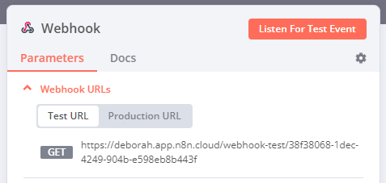

# Webhook node 

Use the Webhook node to create [webhooks](https://en.wikipedia.org/wiki/Webhook), which can receive data from apps and services when an event occurs. It's a trigger node, which means it can start an n8n workflow. This allows services to connect to n8n and run a workflow.

You can use the Webhook node as a trigger for a workflow when you want to receive data and run a workflow based on the data. The Webhook node also supports returning the data generated at the end of a workflow. This makes it useful for building a workflow to process data and return the results, like an API endpoint.

The webhook allows you to trigger workflows from services that don't have a dedicated app trigger node.

## Workflow development process 

n8n provides different **Webhook URL**s for testing and production. The testing URL includes an option to **Listen for test event**. Refer to [Workflow development](workflow-development.md) for more information on building, testing, and shifting your Webhook node to production.

## Node parameters 

Use these parameters to configure your node.

### Webhook URLs 

The Webhook node has two **Webhook URLs**: test and production. n8n displays the URLs at the top of the node panel.

Select **Test URL** or **Production URL** to toggle which URL n8n displays.

<figure>

<figcaption>Sample Webhook URLs in the Webhook node's Parameters tab</figcaption>
</figure>

* **Test**: n8n registers a test webhook when you select **Listen for Test Event** or **Execute workflow**, if the workflow isn't active. When you call the webhook URL, n8n displays the data in the workflow.
* **Production**: n8n registers a production webhook when you publish the workflow. When using the production URL, n8n doesn't display the data in the workflow. You can still view workflow data for a production execution: select the **Executions** tab in the workflow, then select the workflow execution you want to view.

### HTTP Method 

The Webhook node supports standard [HTTP Request Methods](https://developer.mozilla.org/en-US/docs/Web/HTTP/Methods):

* DELETE
* GET
* HEAD
* PATCH
* POST
* PUT 

    

<strong>Webhook max payload</strong>

The webhook maximum payload size is 16MB. If you're self-hosting n8n, you can change this using the <a href="https://app.gitbook.com/s/jm0ZYRpZIPWge2ZSiDYO/host-n8n/configure-n8n/basic-configuration/use-environment-variables/endpoints">endpoint environment variable</a> <code>N8N_PAYLOAD_SIZE_MAX</code>.

### Path 

By default, this field contains a randomly generated webhook URL path, to avoid conflicts with other webhook nodes. 

You can manually specify a URL path, including adding route parameters. For example, you may need to do this if you use n8n to prototype an API and want consistent endpoint URLs.

The **Path** field can take the following formats:

- `/:variable`
- `/path/:variable`
- `/:variable/path`
- `/:variable1/path/:variable2`
- `/:variable1/:variable2`

### Supported authentication methods 

You can require authentication for any service calling your webhook URL. Choose from these authentication methods:

- Basic auth
- Header auth
- JWT auth
- None

Refer to [Webhook credentials](../../credentials/webhook.md) for more information on setting up each credential type.

### Respond 

* **Immediately**: The Webhook node returns the response code and the message **Workflow got started**.
* **When Last Node Finishes**: The Webhook node returns the response code and the data output from the last node executed in the workflow.
* **Using 'Respond to Webhook' Node**: The Webhook node responds as defined in the [Respond to Webhook](../n8n-nodes-base.respondtowebhook.md) node.
* **Streaming response**: Enables real-time data streaming back to the user as the workflow processes. Requires nodes with streaming support in the workflow (for example, the [AI agent](../../cluster-nodes/root-nodes/n8n-nodes-langchain.agent/README.md) node).

### Response Code 

Customize the [HTTP response code](https://developer.mozilla.org/en-US/docs/Web/HTTP/Status) that the Webhook node returns upon successful execution. Select from common response codes or create a custom code.

### Response Data 

Choose what data to include in the response body:

* **All Entries**: The Webhook returns all the entries of the last node in an array.
* **First Entry JSON**: The Webhook returns the JSON data of the first entry of the last node in a JSON object.
* **First Entry Binary**: The Webhook returns the binary data of the first entry of the last node in a binary file.
* **No Response Body**: The Webhook returns without a body.

Applies only to **Respond > When Last Node Finishes**.

## Node options 

Select **Add Option** to view more configuration options. The available options depend on your node parameters. Refer to the table for option availability.

* **Allowed Origins (CORS)**: Set the permitted cross-origin domains. Enter a comma-separated list of URLs allowed for cross-origin non-preflight requests. Use `*` (default) to allow all origins.
* **Binary Property**: Enabling this setting allows the Webhook node to receive binary data, such as an image or audio file. Enter the name of the binary property to write the data of the received file to.
* **Ignore Bots**: Ignore requests from bots like link previewers and web crawlers.
* **IP(s) Whitelist**: Enable this to limit who (or what) can invoke a Webhook trigger URL. Enter a comma-separated list of allowed IP addresses. Access from IP addresses outside the whitelist throws a 403 error. If left blank, all IP addresses can invoke the webhook trigger URL.
* **No Response Body**: Enable this to prevent n8n sending a body with the response.
* **Raw Body**: Specify that the Webhook node will receive data in a raw format, such as JSON or XML.
* **Response Content-Type**: Choose the format for the webhook body.
* **Response Data**: Send custom data with the response.
* **Response Headers**: Send extra headers in the Webhook response. Refer to [MDN Web Docs | Response header](https://developer.mozilla.org/en-US/docs/Glossary/Response_header) to learn more about response headers.
* **Property Name**: by default, n8n returns all available data. You can choose to return a specific JSON key, so that n8n returns the value.

| Option | Required node configuration |
| ------ | --------------------------- | 
| Allowed Origins (CORS) | Any |
| Binary Property | Either:  HTTP Method > POST   HTTP Method > PATCH   HTTP Method > PUT |
| Ignore Bots | Any |
| IP(s) Whitelist | Any |
| Property Name | Both:   Respond > When Last Node Finishes   Response Data > First Entry JSON |
| No Response Body | Respond > Immediately |
| Raw Body | Any |
| Response Code | Any except Respond > Using 'Respond to Webhook' Node |
| Response Content-Type | Both:   Respond > When Last Node Finishes   Response Data > First Entry JSON |
| Response Data | Respond > Immediately |
| Response Headers | Any |

## How n8n secures HTML responses 

Starting with n8n version 1.103.0, n8n automatically wraps HTML responses to webhooks in `<iframe>` tags. This is a security mechanism to protect the instance users.

This has the following implications:

- HTML renders in a sandboxed iframe instead of directly in the parent document.
- JavaScript code that attempts to access the top-level window or local storage will fail.
- Authentication headers aren't available in the sandboxed iframe (for example, basic auth). You need to use an alternative approach, like embedding a short-lived access token within the HTML.
- Relative URLs (for example, `<form action="/">`) won't work. Use absolute URLs instead.

## Templates and examples 

[Browse n8n-nodes-base.webhook integration templates](https://n8n.io/integrations/webhook) or [search all templates](https://n8n.io/workflows/)

## Common issues 

For common questions or issues and suggested solutions, refer to [Common issues](common-issues.md).
