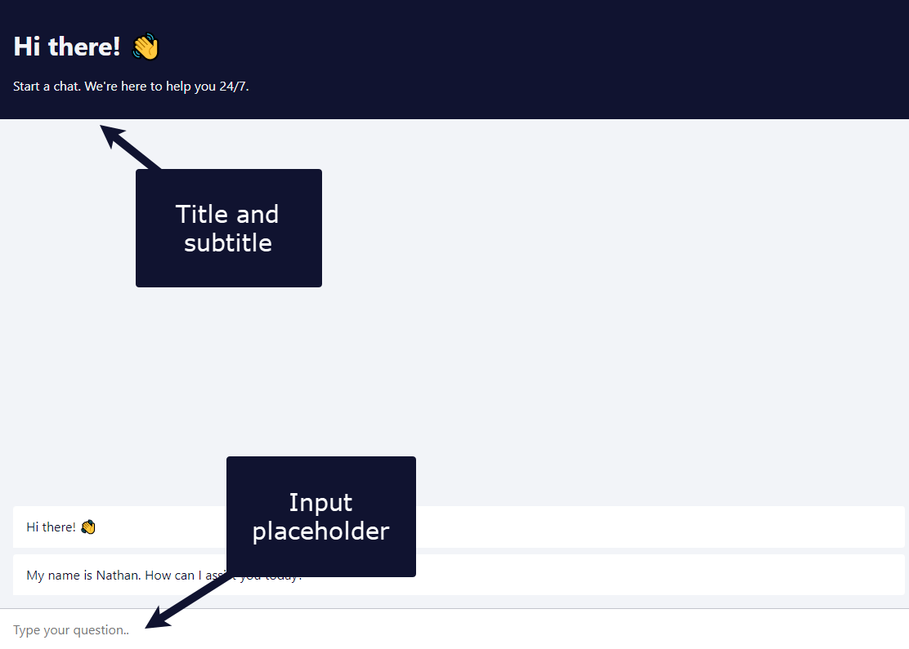
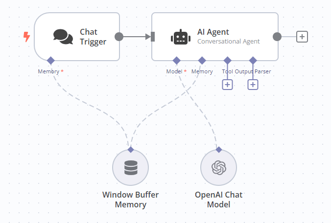
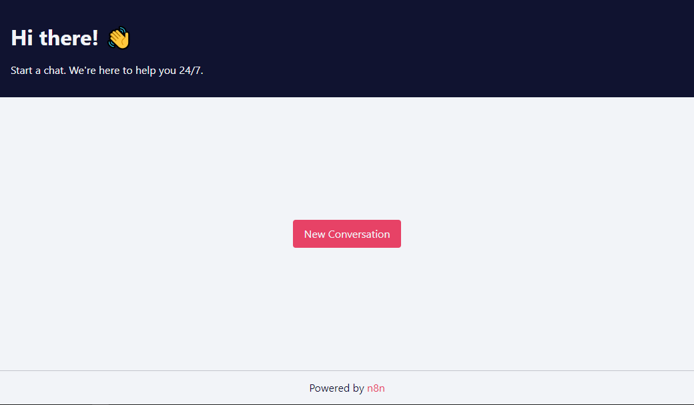

# Chat Trigger node 

Use the Chat Trigger node when building AI workflows for chatbots and other chat interfaces. You can configure how users access the chat, using one of n8n's provided interfaces, or your own. You can add authentication.

You must connect either an agent or chain [root node](../../cluster-nodes/root-nodes/README.md).


**Workflow execution usage**

Every message to the Chat Trigger executes your workflow. This means that one conversation where a user sends 10 messages uses 10 executions from your execution allowance. Check your payment plan for details of your allowance.



**Manual Chat trigger**

This node replaces the Manual Chat Trigger node from version 1.24.0.


## Node parameters 

### Make Chat Publicly Available 

Set whether the chat should be publicly available (turned on) or only available through the manual chat interface (turned off).

Leave this turned off while you're building the workflow. Turn it on when you're ready to publish the workflow and allow users to access the chat.

#### Mode 

Choose how users access the chat. Select from:

* **Hosted Chat**: Use n8n's hosted chat interface. Recommended for most users because you can configure the interface using the [node options](#node-options) and don't have to do any other setup.
* **Embedded Chat**: This option requires you to create your own chat interface. You can use n8n's [chat widget](https://www.npmjs.com/package/@n8n/chat) or build your own. Your chat interface must call the webhook URL shown in **Chat URL** in the node.

#### Authentication 

Choose whether and how to restrict access to the chat. Select from:

* **None**: The chat doesn't use authentication. Anyone can use the chat.
* **Basic Auth**: The chat uses basic authentication.
	* Select or create a **Credential for Basic Auth** with a username and password. All users must use the same username and password.
* **n8n User Auth**: Only users logged in to an n8n account can use the chat.

#### Initial Message(s) 

This parameter's only available if you're using **Hosted Chat**. Use it to configure the message the n8n chat interface displays when the user arrives on the page.

### Make Available in n8n Chat 

Choose whether to make the agent available to Chat Hub.

#### Agent Name 

The name of the agent on Chat Hub.

#### Agent description 

The description of the agent on Chat Hub.

## Node options 

Available options depend on the chat mode.

### Hosted chat options 

#### Allowed Origin (CORS) 

Set the origins that can access the chat URL. Enter a comma-separated list of URLs allowed for cross-origin non-preflight requests.

Use `*` (default) to allow all origins.

#### Input Placeholder, Title, and Subtitle 

Enter the text for these elements in the chat interface.

View screenshot

#### Load Previous Session 

Select whether to load chat messages from a previous chat session.

If you select any option other than **Off**, you must connect the Chat trigger and the Agent you're using to a memory sub-node. The memory connector on the Chat trigger appears when you set **Load Previous Session** to **From Memory**. n8n recommends connecting both the Chat trigger and Agent to the same memory sub-node, as this ensures a single source of truth for both nodes.

View screenshot

#### Response Mode 

Use this option when building a workflow with steps after the agent or chain that's handling the chat. Choose from:

* **When Last Node Finishes**: The Chat Trigger node returns the response code and the data output from the last node executed in the workflow.
* **Using Response Nodes**: The Chat Trigger node responds as defined in a [Chat](../n8n-nodes-langchain.chat.md) node or [Respond to Webhook](../n8n-nodes-base.respondtowebhook.md) node. In this response mode, the Chat Trigger will solely show messages as defined in these nodes and not output the data from the last node executed in the workflow.


**Using Response Nodes**

This mode replaces the 'Using Respond to Webhook Node' mode from version 1.2 of the Chat Trigger node.

* **Streaming response**: Enables real-time data streaming back to the user as the workflow processes. Requires nodes with streaming support in the workflow (for example, the [AI agent](../../cluster-nodes/root-nodes/n8n-nodes-langchain.agent/README.md) node).

#### Require Button Click to Start Chat 

Set whether to display a **New Conversation** button on the chat interface (turned on) or not (turned off).

View screenshot

### Embedded chat options 

#### Allowed Origin (CORS) 

Set the origins that can access the chat URL. Enter a comma-separated list of URLs allowed for cross-origin non-preflight requests.

Use `*` (default) to allow all origins.

#### Load Previous Session 

Select whether to load chat messages from a previous chat session.

If you select any option other than **Off**, you must connect the Chat trigger and the Agent you're using to a memory sub-node. The memory connector on the Chat trigger appears when you set **Load Previous Session** to **From Memory**. n8n recommends connecting both the Chat trigger and Agent to the same memory sub-node, as this ensures a single source of truth for both nodes.

View screenshot

#### Response Mode 

Use this option when building a workflow with steps after the agent or chain that's handling the chat. Choose from:

* **When Last Node Finishes**: The Chat Trigger node returns the response code and the data output from the last node executed in the workflow.
* **Using Response Nodes**: The Chat Trigger node responds as defined in a [Chat](../n8n-nodes-langchain.chat.md) node or [Respond to Webhook](../n8n-nodes-base.respondtowebhook.md) node. In this response mode, the Chat Trigger will solely show messages as defined in these nodes and not output the data from the last node executed in the workflow.


**Using Response Nodes**

This mode replaces the 'Using Respond to Webhook Node' mode from version 1.2 of the Chat Trigger node.

* **Streaming response**: Enables real-time data streaming back to the user as the workflow processes. Requires nodes with streaming support enabled.

## Templates and examples 

[Browse n8n-nodes-base.compression integration templates](https://n8n.io/integrations/chat-trigger) or [search all templates](https://n8n.io/workflows/)

## Related resources 



## Set the chat response manually 

You need to manually set the chat response when you don't want to directly send the output of an Agent or Chain node to the user. Instead, you want to take the output of an Agent or Chain node and modify it or do something else with it before sending it back to the user.

In a basic workflow, the Agent and Chain nodes output a parameter named either `output` or `text`, and the Chat trigger sends the value of this parameter to the user as the chat response. 

If you need to manually create the response sent to the user, you must create a parameter named either `text` or `output`. If you use a different parameter name, the Chat trigger sends the entire object as its response, not just the value.


**Chat node**

When you are using a [Chat](../n8n-nodes-langchain.chat.md) node to manually create the response sent to the user, you must set the Chat Trigger response mode to 'Using Response Nodes'.


## Common issues 

For common questions or issues and suggested solutions, refer to [Common Issues](common-issues.md).
