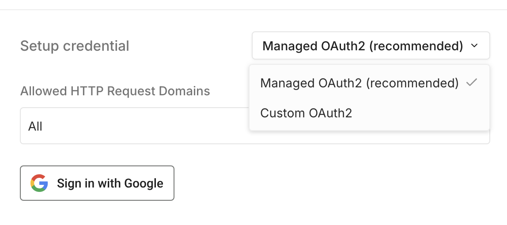

# Google OAuth2 single service

This document contains instructions for creating a Google credential for a single service. They're also available as a [video](oauth-single-service.md#video).

## Prerequisites 

* Create a [Google Cloud](https://cloud.google.com/) account.

## Managed OAuth2 

n8n Cloud users can use **Managed OAuth2** for the following nodes:



To use **Managed OAuth2**, just click **Sign in with Google** in the credentials screen. No more setup is required in the Google Cloud Console or elsewhere.

If you prefer to use Custom OAuth2, use the dropdown to change the authentication type.

## Custom OAuth2 

Managed OAuth2 isn't available for self-hosted n8n users, nor for Google nodes not listed [above](oauth-single-service.md#managed-oauth2). You must create a custom OAuth2 single service credential. This means creating an app in the Google Cloud Console and connecting it to n8n with a Client ID and Client Secret.

The rest of this document covers the full process.

## Set up Custom OAuth2 

There are five steps to connecting your n8n credential to Google services:

1. [Create a Google Cloud Console project](oauth-single-service.md#create-a-google-cloud-console-project).
2. [Enable APIs](oauth-single-service.md#enable-apis).
3. [Configure your OAuth consent screen](oauth-single-service.md#configure-your-oauth-consent-screen).
4. [Create your Google OAuth client credentials](oauth-single-service.md#create-your-google-oauth-client-credentials).
5. [Finish your n8n credential](oauth-single-service.md#finish-your-n8n-credential).

### Create a Google Cloud Console project 

First, create a Google Cloud Console project. If you already have a project, jump to the [next section](oauth-single-service.md#enable-apis):



### Enable APIs 

With your project created, enable the APIs you'll need access to:



### Configure your OAuth consent screen 

If you haven't used OAuth in your Google Cloud project before, you'll need to [configure the OAuth consent screen](https://developers.google.com/workspace/guides/configure-oauth-consent):

1.  Access your [Google Cloud Console - Library](https://console.cloud.google.com/apis/library). Make sure you're in the correct project.

    <figure><figcaption>
Check the project dropdown in the Google Cloud top navigation
</figcaption></figure>
2. Open the left navigation menu and go to **APIs & Services > OAuth consent screen**. Google will redirect you to the Google Auth Platform overview page.
3. Select **Get started** on the **Overview** tab to begin configuring OAuth consent.
4. Enter an **App name** and **User support email** to include on the Oauth screen. Select **Next** to continue.
5.  For the **Audience**, select **Internal** for user access within your organization's Google workspace or **External** for any user with a Google account. Refer to Google's [User type documentation](https://support.google.com/cloud/answer/15549945?sjid=17061891731152303663-EU#user-type) for more information on user types. Select **Next** to continue. 

    

<strong>Testing mode and test users</strong>

If you select <strong>External</strong>, your app will default to Testing mode. In this mode, only Google accounts you manually add as test users can complete the OAuth flow — everyone else will see an "access denied" screen. See <a href="oauth-single-service.md#google-hasnt-verified-this-app">Google hasn't verified this app</a> to learn how to add them.

6. Select the **Email addresses** Google should use to contact you about changes to your project. Select **Next** to continue.
7. Read and accept the Google's User Data Policy. Select **Continue** and then select **Create**.
8. In the left-hand menu, select **Branding**.
9. In the **Authorized domains** section, select **Add domain**:
   * If you're using n8n's Cloud service, add `n8n.cloud`
   * If you're [self-hosting](https://app.gitbook.com/s/jm0ZYRpZIPWge2ZSiDYO/host-n8n), add the domain of your n8n instance.
10. Select **Save** at the bottom of the page.

### Create your Google OAuth client credentials 

Next, create the OAuth client credentials in Google:

1. Access your [Google Cloud Console](https://console.cloud.google.com/). Make sure you're in the correct project.
2. In the **APIs & Services** section, select [**Credentials**](https://console.cloud.google.com/apis/credentials).
3. Select **+ Create credentials** > **OAuth client ID**.
4. In the **Application type** dropdown, select **Web application**.
5. Google automatically generates a **Name**. Update the **Name** to something you'll recognize in your console.
6.  From your n8n credential, copy the **OAuth Redirect URL**. Paste it into the **Authorized redirect URIs** in Google Console. 

    

<strong>OAuth redirect URL for self-hosting</strong>

If you're running n8n on your local machine, you don't need a public domain, SSL certificate, or port forwarding to use Google OAuth. Google allows localhost as a valid redirect URI for development purposes. Your n8n OAuth redirect URL will look something like this: <code>http://localhost:5678/rest/oauth2-credential/callback</code> For more details on acceptable redirect URIs, refer to <a href="https://support.google.com/cloud/answer/15549257?hl=en#zippy=%2Cweb-applications">Google's redirect URI documentation</a>.

7. Select **Create**.

### Finish your n8n credential 

With the Google project and credentials fully configured, finish the n8n credential:

1. From Google's **OAuth client created** modal, copy the **Client ID**. Enter this in your n8n credential.
2. From the same Google modal, copy the **Client Secret**. Enter this in your n8n credential.
3. In n8n, select **Sign in with Google** to complete your Google authentication.
4. **Save** your new credentials.

## Video 



## Troubleshooting 

### Google hasn't verified this app 



### Google Cloud app becoming unauthorized 



### redirect\_uri\_mismatch 

This error means the redirect URI n8n is sending doesn't match any of the URIs registered in your Google Cloud Console OAuth client.

**Fix:** Copy the **OAuth Redirect URL** from your n8n credential panel and paste it exactly — including the protocol (`http` or `https`) and port number — into the **Authorized redirect URIs** field of your Google OAuth client.

### Access denied / "app not verified" 

This usually happens when your app is still in Testing mode and the Google account you're trying to authenticate with hasn't been added as a test user.

**Fix:** Go to **APIs & Services** > **OAuth consent screen** > **Test users** and add the account you're trying to use.

### invalid\_client 

This error typically means the Client ID or Client Secret in your n8n credential doesn't match what's in Google Cloud Console.

**Fix:** Go back to your OAuth client in Google Cloud Console, copy both values fresh, and re-enter them in n8n. Watch out for accidental spaces when copying.
