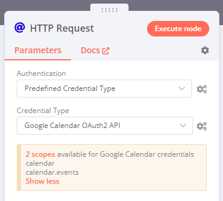

# Custom API operations 



## Predefined credential types 

A predefined credential type is a credential that already exists in n8n. You can use predefined credential types instead of generic credentials in the HTTP Request node.

For example: you create an Asana credential, for use with the Asana node. Later, you want to perform an operation that isn't supported by the Asana node, using Asana's API. You can use your existing Asana credential in the HTTP Request node to perform the operation, without additional authentication setup.

### Using predefined credential types 



### Credential scopes 

Some existing credential types have specific scopes: endpoints that they work with. n8n warns you about this when you select the credential type.

For example, follow the steps in [Using predefined credential types](#using-predefined-credential-types), and select **Google Calendar OAuth2 API** as your **Credential Type**. n8n displays a box listing the two endpoints you can use this credential type with:

