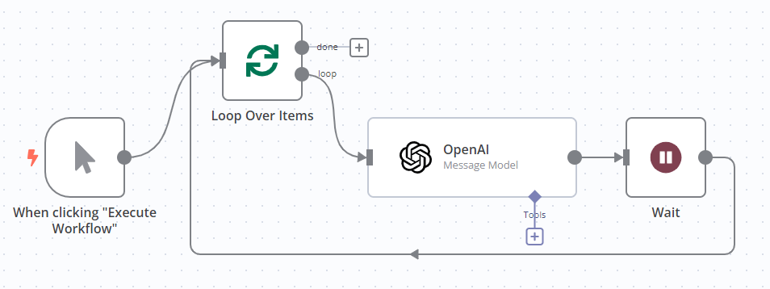

# Handling API rate limits 

[API](https://app.gitbook.com/s/CxSeOtVxqqhfxMSac0AV/key-concept-glossary#api) rate limits are restrictions on request frequency. For example, an API may limit the number of requests you can make per minute, or per day.

APIs can also limits how much data you can send in one request, or how much data the API sends in a single response.

## Identify rate limit issues 

When an n8n node hits a rate limit, it errors. n8n displays the error message in the node output panel. This includes the error message from the service.

If n8n received error 429 (too many requests) from the service, the error message is **The service is receiving too many requests from you**.

To check the rate limits for the service you're using, refer to the API documentation for the service.

## Handle rate limits for integrations 

There are two ways to handle rate limits in n8n's integrations: using the Retry On Fail setting, or using a combination of the [Loop Over Items](core-nodes/n8n-nodes-base.splitinbatches.md) and [Wait](core-nodes/n8n-nodes-base.wait.md) nodes: 

* Retry On Fail adds a pause between API request attempts.
* With Loop Over Items and Wait you can break you request data into smaller chunks, as well as pausing between requests.

### Enable Retry On Fail 

When you enable Retry On Fail, the node automatically tries the request again if it fails the first time.

1. Open the node.
1. Select **Settings**.
1. Enable the **Retry On Fail** toggle.
1. Configure the retry settings: if using this to work around rate limits, set **Wait Between Tries (ms)** to more than the rate limit. For example, if the API you're using allows one request per second, set **Wait Between Tries (ms)** to `1000` to allow a 1 second wait.

### Use Loop Over Items and Wait 

Use the Loop Over Items node to batch the input items, and the Wait node to introduce a pause between each request.

1. Add the Loop Over Items node before the node that calls the API. Refer to [Loop Over Items](core-nodes/n8n-nodes-base.splitinbatches.md) for information on how to configure the node.
1. Add the Wait node after the node that calls the API, and connect it back to the Loop Over Items node. Refer to [Wait](core-nodes/n8n-nodes-base.wait.md) for information on how to configure the node.

For example, to handle rate limits when using OpenAI:

## Handle rate limits in the HTTP Request node 

The HTTP Request node has built-in settings for handling rate limits and large amounts of data.

### Batch requests 

Use the Batching option to send more than one request, reducing the request size, and introducing a pause between requests. This is the equivalent of using Loop Over Items and Wait.

1. In the HTTP Request node, select **Add Option** > **Batching**.
1. Set **Items per Batch**: this is the number of input items to include in each request.
1. Set **Batch Interval (ms)** to introduce a delay between requests. For example, if the API you're using allows one request per second, set **Wait Between Tries (ms)** to `1000` to allow a 1 second wait.

### Paginate results 

APIs paginate their results when they need to send more data than they can handle in a single response. For more information on pagination in the HTTP Request node, refer to [HTTP Request node | Pagination](core-nodes/n8n-nodes-base.httprequest/README.md#pagination).
