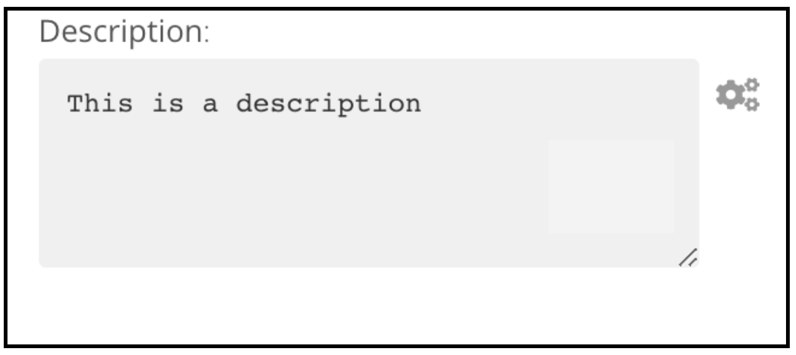
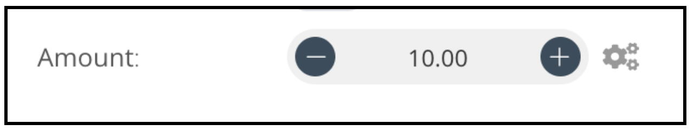
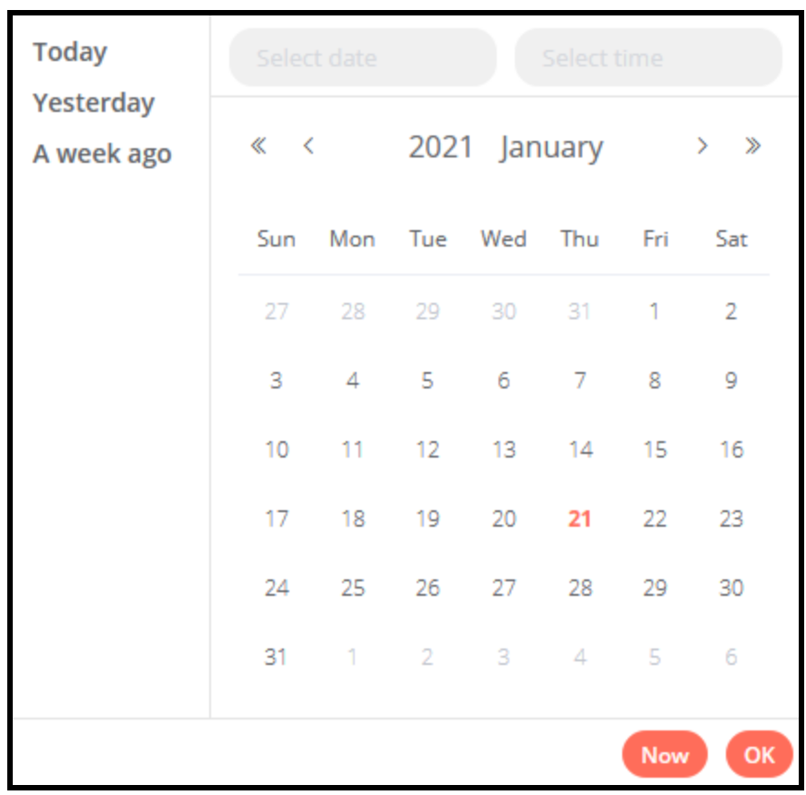
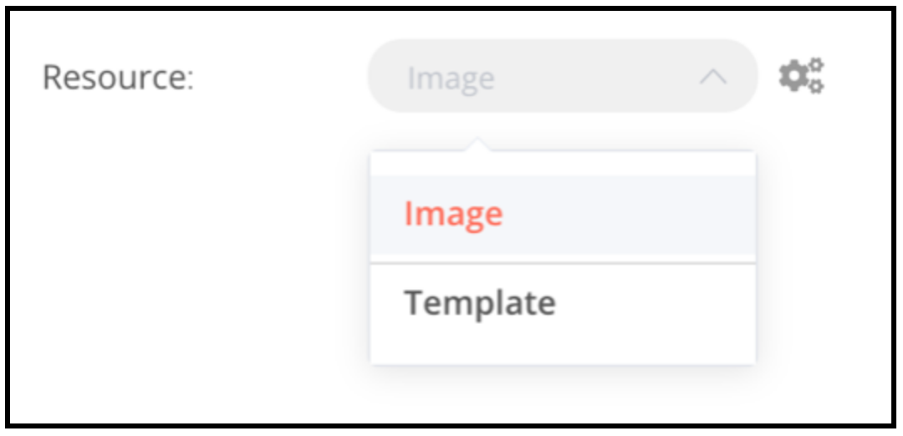
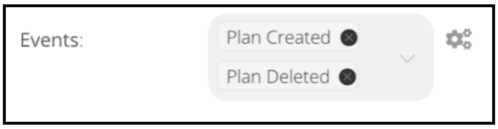
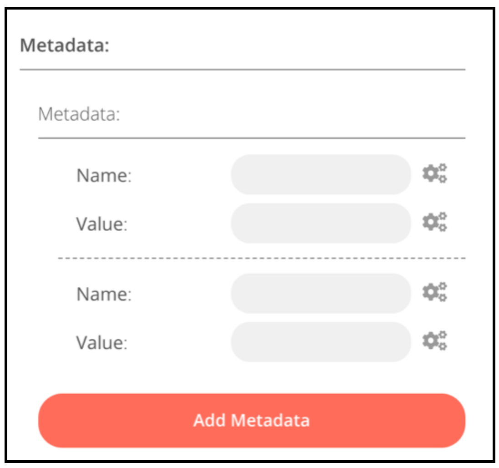
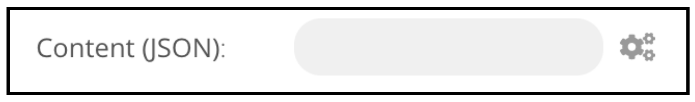

# Node UI Elements

n8n provides a set of predefined UI components (based on a JSON file) that allow users to input all sorts of data types. Currently, the following UI elements are available in n8n.

[[toc]]

## String

The `string` type is used to input string values.

Basic configuration

```typescript
{
	displayName: Name, // The value the user would see in the UI
	name: name, // The name use to reference the element UI within the code
	type: string,
	required: true, // Whether the field is required or not
	default: 'n8n', // Value that would be set by default
	description: 'The name of the user',
},
```


Variation for inputting passwords

```typescript
{
	displayName: 'Password',
	name: 'password',
	type: 'string',
	required: true,
	typeOptions: {
		password: true,
	},
	default: '',
	description: `User's password`,

},
```


Variation with multiple rows

```typescript
{
	displayName: 'Description',
	name: 'description',
	type: 'string',
	required: true,
	typeOptions: {
		rows: 4,
	},
	default: '',
	description: 'Description',
},
```




## Number

The `number` type is used to input numbers.

Basic configuration

```typescript
{
	displayName: 'Age',
	name: 'age',
	type: 'number',
	required: true,
	typeOptions: {
		maxValue: 10,
		minValue: 0,
		numberStepSize: 1,
	},
	default: 10,
	description: 'Your current age',
},
```


Variation with decimal points

```typescript
{
	displayName: 'Amount',
	name: 'amount',
	type: 'number',
	required: true,
	typeOptions: {
		numberPrecision: 2,
	},
	default: 10.00,
	description: 'Your current amount',
},
```




## Collection

The `collection` type is used to input a collection of fields. For example, additional fields (or optional fields).

```typescript
{
	displayName: 'Filters',
	name: 'filters',
	type: 'collection',
	placeholder: 'Add Field',
	default: {},
	options: [
		{
			displayName: 'Type',
			name: 'type',
			type: 'options',
			options: [
				{
					name: 'Automated',
					value: 'automated',
				},
				{
					name: 'Past',
					value: 'past',
				},
				{
					name: 'Upcoming',
					value: 'upcoming',
				},
			],
			default: '',
		},
	],
},
```


## Datetime

The `dateTime` type provides a calendar from which you can pick a specific date and time.

```typescript
{
	displayName: 'Modified Since',
	name: 'modified_since',
	type: 'dateTime',
	default: '',
	description: 'The date and time when the file was last modified',
},
```




## Boolean

The `boolean` type is used to input a value that is either true or false. It is shown as a toggle that can be either on or off.

```typescript
{
	displayName: 'Wait for Image',
	name: 'waitForImage',
	type: 'boolean',
	default: true, // Initial state of the toggle
	description: 'Whether to wait for the image or not',
},
```


## Color

The `color` type provides a color palette from which a specific color can be selected.

```typescript
{
	displayName: 'Background Color',
	name: 'backgroundColor',
	type: 'color',
	default: '', // Initially selected color
},
```


## Options

The `options` type is used to provide options from which a single one has to be selected.

```typescript
{
	displayName: 'Resource',
	name: 'resource',
	type: 'options',
	options: [
		{
			name: 'Image',
			value: 'image',
		},
		{
			name: 'Template',
			value: 'template',
		},
	],
	default: 'image', // The initially selected option
	description: 'Resource to consume',
},
```




## Multi Options

The `multiOptions` type is used to provide options from which many can be selected.

```typescript
{
	displayName: 'Events',
	name: 'events',
	type: 'multiOptions',
	options: [
		{
			name: 'Plan Created',
			value: 'planCreated',
		},
		{
			name: 'Plan Deleted',
			value: 'planDeleted',
		},
	],
	default: [], // Initially selected options
	description: 'The events to be monitored',
},
```




## Fixed Collection

The `fixedCollection? type is used to present groups of fields that are semantically related.

```typescript
{
	displayName: 'Metadata',
	name: 'metadataUi',
	placeholder: 'Add Metadata',
	type: 'fixedCollection',
	default: '',
	typeOptions: {
		multipleValues: true,
	},
	description: '',
	options: [
		{
			name: 'metadataValues',
			displayName: 'Metadata',
			values: [
				{
					displayName: 'Name',
					name: 'name',
					type: 'string',
					default: 'Name of the metadata key to add.',
				},
				{
					displayName: 'Value',
					name: 'value',
					type: 'string',
					default: '',
					description: 'Value to set for the metadata key.',
				},
			],
		},
	],
},
```




## JSON

The `json` type is used to input data formatted as JSON.

```typescript
{
	displayName: 'Content (JSON)',
	name: 'content',
	type: 'json',
	default: '',
	description: '',
},
```


