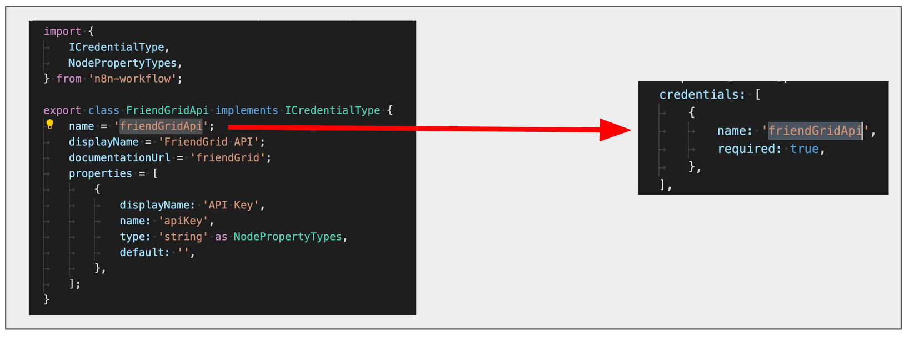

# Troubleshooting

## Credentials

### Error message: 'Credentials of type “*” are not known'

Ensure that the name in the credentials array matches the name used in the property name of the credentials' class.

## Editor UI

### Error message: 'There was a problem loading init data: API-Server can not be reached. It is probably down'

- Ensure that the node’s file name, class’s name, and node’s folder name matches the path added to `packages/nodes-base/package.json`.
- Ensure the names used in the `displayOptions` property are names used by UI elements in the node.

### Node icon doesn't show up in the Create Node menu and the Editor UI

- Ensure that the icon is in the same folder as the node.
- Ensure that it's either in PNG or SVG format.
- When the icon is referenced in the 'icon' property, ensure that it includes the logo extension (`.png` or `.svg`) and that it is preceded by the world `file:`. For example, `file:friendGrid.png` or `file:friendGrid.svg`.

### Node icon does not fit correctly

- If you are using an SVG file, make sure the canvas size is square. You can find instructions to change the canvas size of an SVG file using GIMP [here](https://docs.gimp.org/2.10/en/gimp-image-resize.html).
- If you are using a PNG file, make sure that it's 60x60 pixels.

### Node does not show up in the Create Node menu

Ensure that the node is registered in the `packages/nodes-base/package.json` file.

### Changes to the description properties do not show in the UI on refreshing

Every time a change is made to the description properties, you have to stop the current n8n process (ctrl + c) and run it again (npm run dev).
