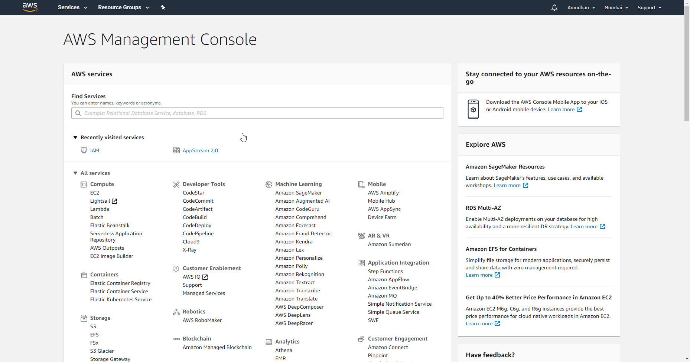

# AWS

You can use these credentials to authenticate the following nodes with AWS.
- [AWS Lambda](../../nodes-library/nodes/AWSLambda/README.md)
- [AWS S3](../../nodes-library/nodes/AWSS3/README.md)
- [AWS SES](../../nodes-library/nodes/AWSSES/README.md)
- [AWS SNS](../../nodes-library/nodes/AWSSNS/README.md)
- [AWS SNS Trigger](../../nodes-library/trigger-nodes/AWSSNSTrigger/README.md)

## Prerequisites

Create an [AWS](https://aws.amazon.com/) account.

## Using Access Token

1. Open your AWS Management Console.
2. Click on your name on the top right and select 'My Security Credentials' from the dropdown.
3. Under the Access keys dropdown, click on the 'Create New Access Key' button.
4. Click on 'Show Access Key' to retrieve your ID and key for use with your AWS node credentials in n8n.

