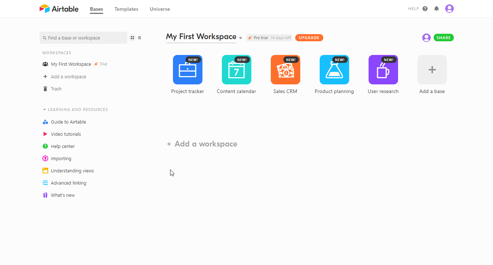

# Airtable

You can use these credentials to authenticate the following nodes with Airtable.
- [Airtable](../../nodes-library/nodes/Airtable/README.md)
- [Airtable Trigger](../../nodes-library/trigger-nodes/AirtableTrigger/README.md)

## Prerequisites

Create an [Airtable](https://airtable.com/) account.

## Using Access Token

1. Open your Airtable dashboard.
2. Click on your user icon in the top right of the window.
3. Click on the Account button.
4. Under the API section, click "Generate API key".
5. Use this API key with your Airtable node credentials in n8n.

