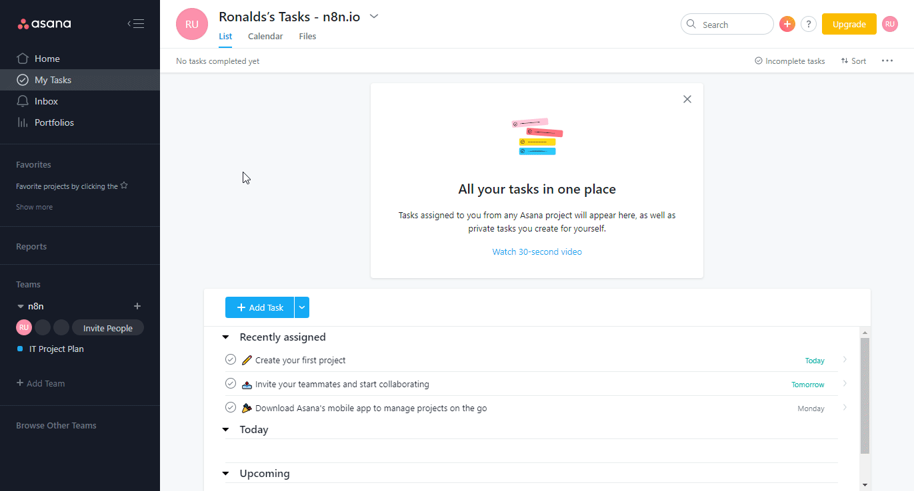

# Asana
You can find information about the operations supported by the Asana node on the [integrations](https://n8n.io/integrations/n8n-nodes-base.asana) page. You can also browse the source code of the node on [Github](https://github.com/n8n-io/n8n/tree/master/packages/nodes-base/nodes/Asana).

The following is a summary based off Asana's own[ documentation](https://developers.asana.com/docs/authentication-basics) regarding authentication.

## Pre-requisites

Create an [Asana](https://www.Asana.com/) account.

## Using OAuth

1. Open your Asana dashboard.
2. Click on your user icon in the top right of the window.
3. Click on "My Profile Settings".
4. Click on the Apps tab.
5. Click on "Manage Developer Apps".
6. Click on "New App".
7. Enter name and Create app.
8. Copy the Client ID and Client Secret to be used in your n8n Asana node credentials.
9. In the redirect URL enter the provided n8n redirect URL found in the Asana's node credentials creation settings. 

## Using Access Token

1. Open your Asana dashboard.
2. Click on your user icon in the top right of the window.
3. Click on "My Profile Settings".
4. Click on the Apps tab.
5. Click on "Manage Developer Apps".
6. Click on "New Access Token" and then generate.
7. Use this token with your Asana node credentials in n8n.

