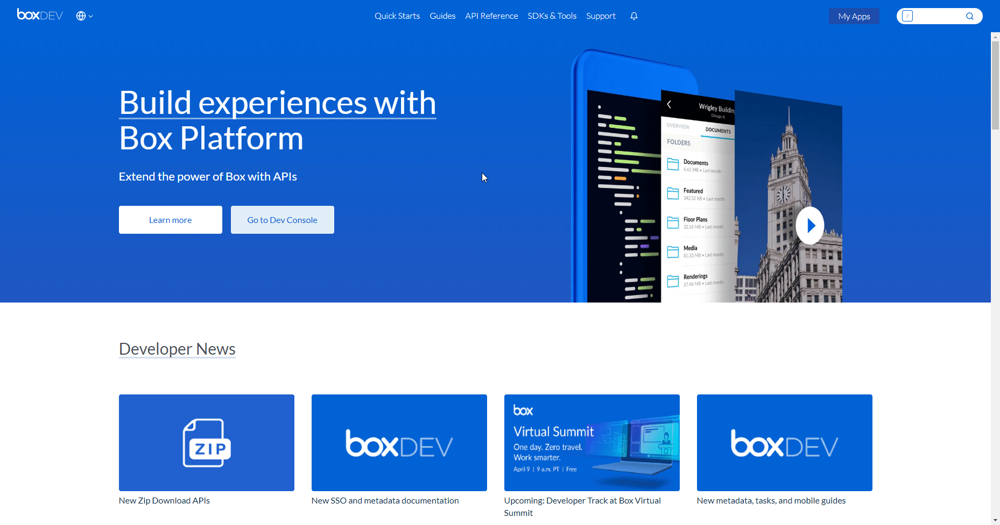

# Box

You can use these credentials to authenticate the following nodes with Box.
- [Box](../../nodes-library/nodes/Box/README.md)
- [Box Trigger](../../nodes-library/trigger-nodes/BoxTrigger/README.md)

## Prerequisites

Create a [Box](https://www.box.com/) account.

## Using OAuth

::: tip ⛅️ Note for n8n.cloud users
You'll only need to enter the Credentials Name and click on the circle button in the OAuth section to connect your Box account to n8n.
:::

1. Access the [Box Developers Console](https://app.box.com/developers/console).
2. Click on the *Create New App* button.
3. Select 'Custom App' and click *Next*.
4. Select 'Standard OAuth 2.0 (User Authentication)'and click *Next*.
5. Enter any other necessary information and click on the *Create App* button.
6. Copy the 'OAuth Callback URL' provided in the Box OAuth2 API credentials in n8n and paste it in the 'Redirect URI' field in the Box app page.
7. Click the *Save Changes* button and use the displayed 'Client ID' and the 'Client Secret' with your Box OAuth2 API credentials in n8n.
10. Click on the circle button in the OAuth section to connect a Box account to n8n.
11. Click the *Save* button to save your credentials in n8n.

