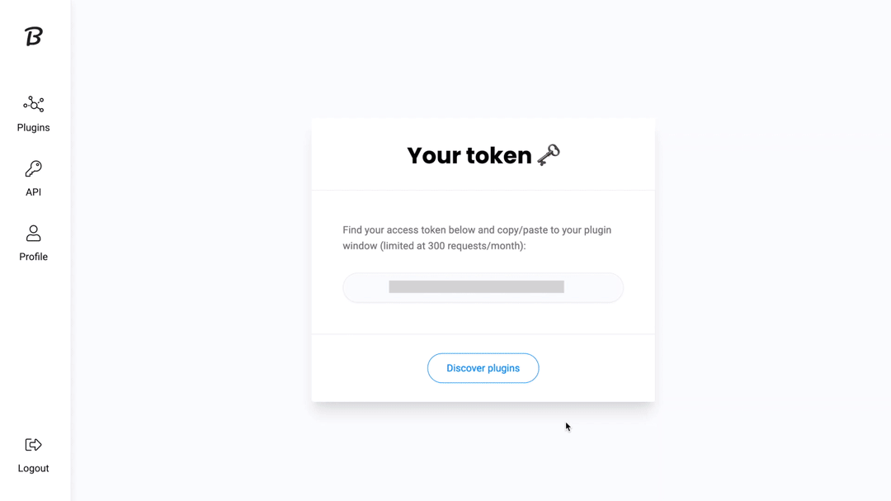

# Brandfetch

You can use these credentials to authenticate the following nodes with Brandfetch.
- [Brandfetch](../../nodes-library/nodes/Brandfetch/README.md)

## Prerequisites

Create a [Brandfetch](https://brandfetch.io/account) account.

## Using API Key

1. Access your [Brandfetch dashboard](https://brandfetch.io/dashboard).
2. Click on ***API*** on the left sidebar.
3. Select a plan and click on the ***Get API Key*** button.
4. Use the ***App Key*** with your Brandfetch API credentials in n8n.

