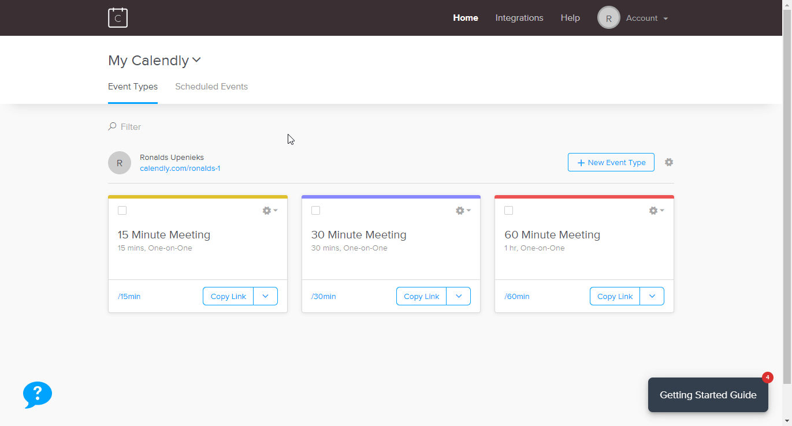

# Calendly

You can find information about the operations supported by the Calendly node on the [integrations](https://n8n.io/integrations/n8n-nodes-base.calendlyTrigger) page. You can also browse the source code of the node on [GitHub](https://github.com/n8n-io/n8n/tree/master/packages/nodes-base/nodes/Calendly).

## Prerequisites

Create a [Calendly](https://www.calendly.com/) premium account.

## Using Access Token

1. Open your Calendly dashboard.
2. Click on "Integrations".
3. Use API key in your Calendly node credentials in n8n.

