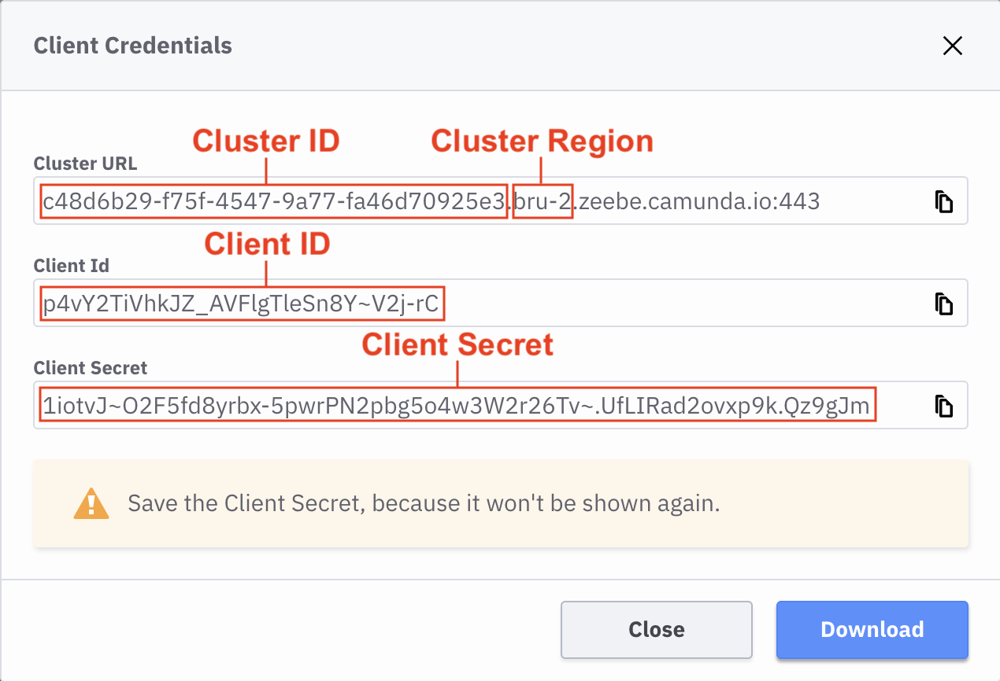

# Camunda Cloud

You can use these credentials to authenticate the following nodes with Camunda Cloud.

- [Camunda Cloud](../../nodes-library/nodes/CamundaCloud/README.md)
- [Camunda Cloud Trigger](../../nodes-library/trigger-nodes/camundaCloudTrigger/README.md)

## Prerequisites

- A [Camunda Cloud](https://accounts.cloud.camunda.io/signup) account.

## Creating Camunda Cloud Client credentials

1. Login to the [Camunda Cloud Console](https://console.cloud.camunda.io).
2. On the "Clusters" tab, click on the cluster you want to use (or create a new one first)
3. On the "API" tab, click the "Create" button to create new client credentials
4. Enter a descriptive string into the "Client Name" field, e.g. "n8n-io"
5. Make sure that "Zeebe" is selected in the "Scopes" section
6. Click the "Create" button
7. Extract the relevant values as follows and copy them into the Camunda Cloud credentials dialog of n8n
   
