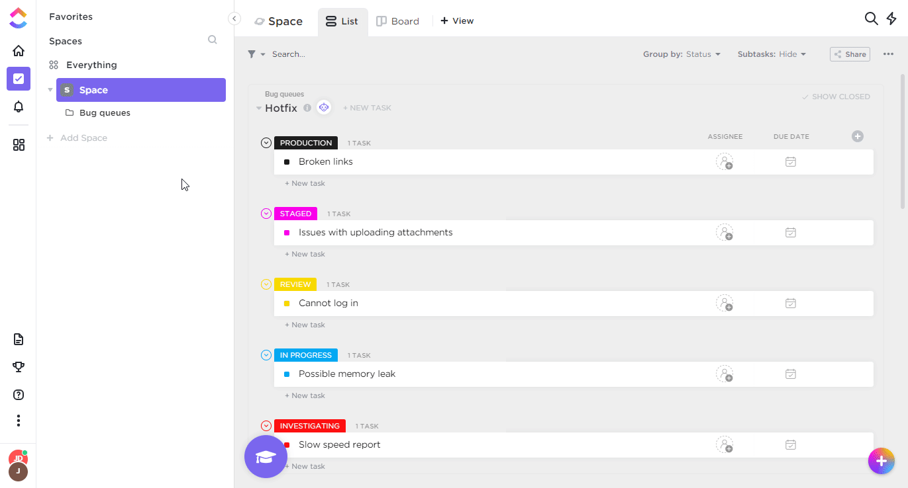

# ClickUp

You can find information about the operations supported by the ClickUp node on the [integrations](https://n8n.io/integrations/n8n-nodes-base.clickup) page. You can also browse the source code of the node on [GitHub](https://github.com/n8n-io/n8n/tree/master/packages/nodes-base/nodes/Clickup).

## Prerequisites

Create a [ClickUp](https://www.clickup.com/) account.

## Using OAuth

1. Open your ClickUp dashboard.
2. Click on your profile icon in the bottom left.
3. Click on "Settings" under your workspace profile.
4. Click on "Integrations".
5. Click on "ClickUp API".
6. Click on Create app.
7. Enter in App name and redirect URL(s).
8. Use Client ID and client Secret key in your ClickUp node credentials in n8n.
9. Enter n8n provided redirect URL in configuration. Redirect URL Explanation [here](../README.md).

## Using Access Token

1. Open your ClickUp dashboard.
2. Click on your profile icon in the bottom left.
3. Click on "Apps".
4. Click on "Generate" under API token.
5. Use selected API key in your ClickUp node credentials in n8n.

