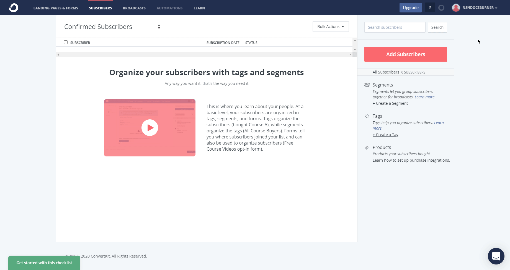

# ConvertKit

You can use these credentials to authenticate the following nodes with ConvertKit.
- [ConvertKit](../../nodes-library/nodes/ConvertKit/README.md)
- [ConvertKit Trigger](../../nodes-library/trigger-nodes/ConvertKitTrigger/README.md)

## Prerequisites

Create a [ConvertKit](https://convertkit.com/) account.

## Using Access Token

1. Access your ConvertKit dashboard.
2. Click on the user icon in the top right and select ***Account settings***.
3. Click on ***Show*** in the ***API Secret*** section to reveal the access token.
4. Use the access token in the ***API Secret*** section with your ConvertKit API credentials in n8n.
5. Click on the ***Save*** button to save your credentials.

