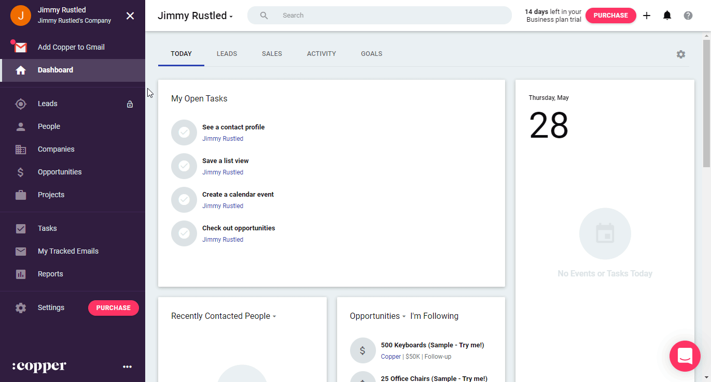

# Copper

You can use these credentials to authenticate the following nodes with Copper.
- [Copper Trigger](../../nodes-library/trigger-nodes/CopperTrigger/README.md)

## Prerequisites

Create a [Copper](https://www.copper.com/) account.

## Using Access Token

1. Open your Copper dashboard.
2. Click on Settings.
3. Click on Integrations, API Keys.
4. Generate API key.
5. Use selected API key and your registered email in your Copper node credentials in n8n.

