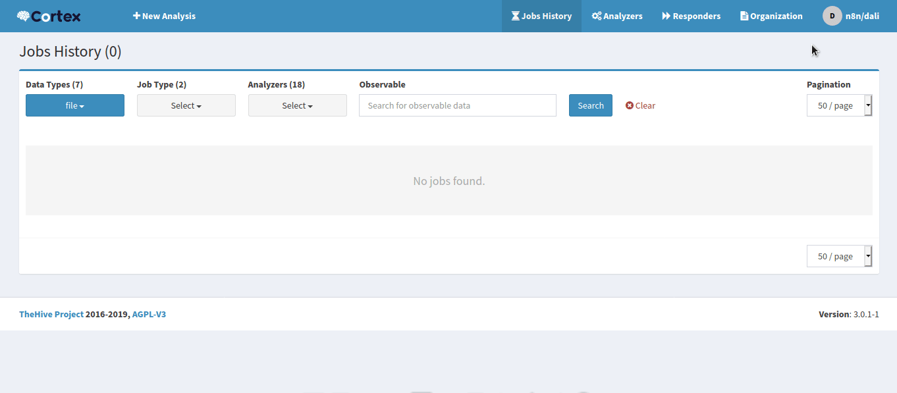

# Cortex

You can find information about the operations supported by the Cortex node on the [integrations](./integrations/n8n-nodes-base.cortex) page. You can also browse the source code of the node on [Github](https://github.com/n8n-io/n8n/tree/master/packages/nodes-base/nodes/Cortex).

## Pre-requisites

Have access to a Cortex instance.   
Ask admin for an API key.

## Using Access Token

1. Open your Cortex dashboard.
2. Click on your user icon in the top right of the window.
3. Click on the Settings button.
4. Click on the 'Reveal' button at the bottom.
5. Use the API key with your Cortex instance URL to create your Cortex node credentials in n8n.

