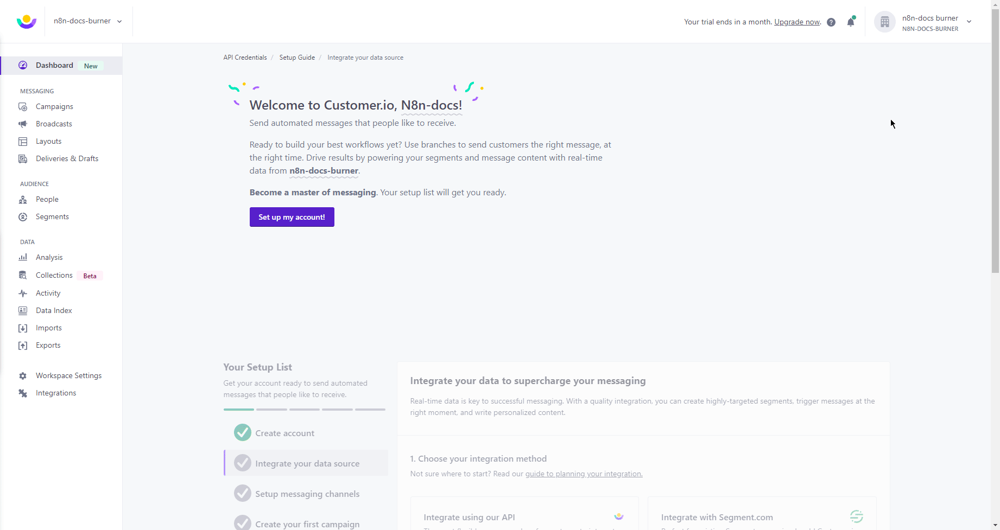

# Customer.io

You can find information about the operations supported by the Customer.io node on the [integrations](https://n8n.io/integrations/n8n-nodes-base.customerIo) page. You can also browse the source code of the node on [GitHub](https://github.com/n8n-io/n8n/tree/master/packages/nodes-base/nodes/CustomerIo).

## Prerequisites

Create a [Customer.io](https://customer.io/) account.

## Using Access Token

1. Open your Customer.io dashboard.
2. Click on the user icon in the top right and select ***Account settings***.
3. Click on ***API Credentials***.
4. Click on the ***Create Tracking API Key*** button.
5. Enter a name for the API key in the ***Name*** field, select a workspace, and click ***Create Tracking API Key***.
6. Use the displayed ***Site ID*** and ***API Key*** with your Customer.io API credentials in n8n.
7. Next, click on the ***App API Keys*** tab in the 'Manage API Credentials' page.
8. Click on the ***Create App API Key** button.
9. Enter a name for the API key in the ***Name*** field, select a workspace, and click ***Create App API Key***.
Use the displayed API Key with your Customer.io API credentials in n8n.
10. Click on the ***Save*** button to save your credentials.

