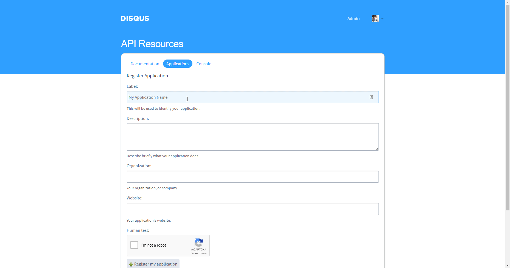

# Disqus

You can find information about the operations supported by the Disqus node on the [integrations](https://n8n.io/integrations/n8n-nodes-base.disqus) page. You can also browse the source code of the node on [GitHub](https://github.com/n8n-io/n8n/tree/master/packages/nodes-base/nodes/Disqus).

## Prerequisites

Create a [Disqus](https://www.disqus.com/) account.

## Using Access Token

1. Access the [Disqus Application Registration Page](https://disqus.com/api/applications/register/).
2. Fill out the application information and click on ***Register my application***.
3. Click on ***Details*** at the top and use the provided 'API Key' with your Disqus node credentials in n8n.

