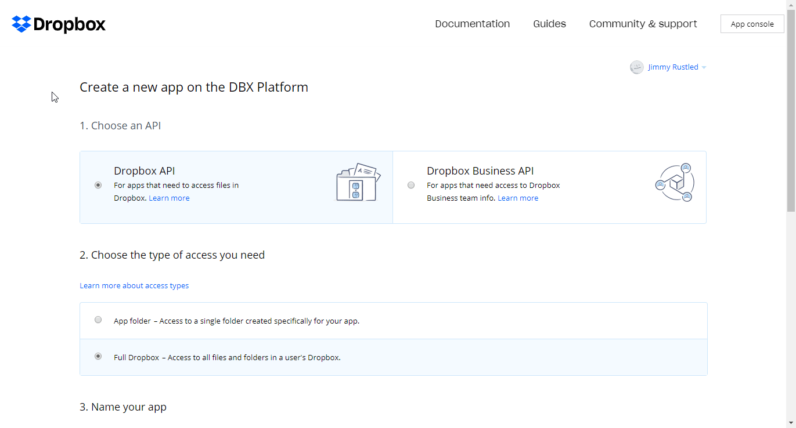

# Dropbox

You can find information about the operations supported by the Dropbox node on the [integrations](https://n8n.io/integrations/n8n-nodes-base.dropbox) page. You can also browse the source code of the node on [GitHub](https://github.com/n8n-io/n8n/tree/master/packages/nodes-base/nodes/Dropbox).

## Prerequisites

Create a [Dropbox](https://www.dropbox.com/) account.

## Using OAuth

1. Access the [Dropbox app creation page](https://www.dropbox.com/developers/apps/create).
2. In 'Choose an API', select *Dropbox API*.
3. In 'Choose your app's permissions model', select *Scoped access*.
4. In 'Choose the type of access you need', select *App folder*.
5. In 'Name your app', enter a name for your app.
6. Accept the terms and conditions.
7. Click on *Create app*.
8. In the Dropbox app dashboard, navigate to 'Settings', scroll down to 'OAuth2' and click on the *Generate* button under 'Generated access token'.
9. In the Dropbox app dashboard, navigate to 'Permissions', select the permissions your workflow will need and click on the *Submit* button.
10. Return to n8n and enter the Access Token in your Dropbox API credentials.

