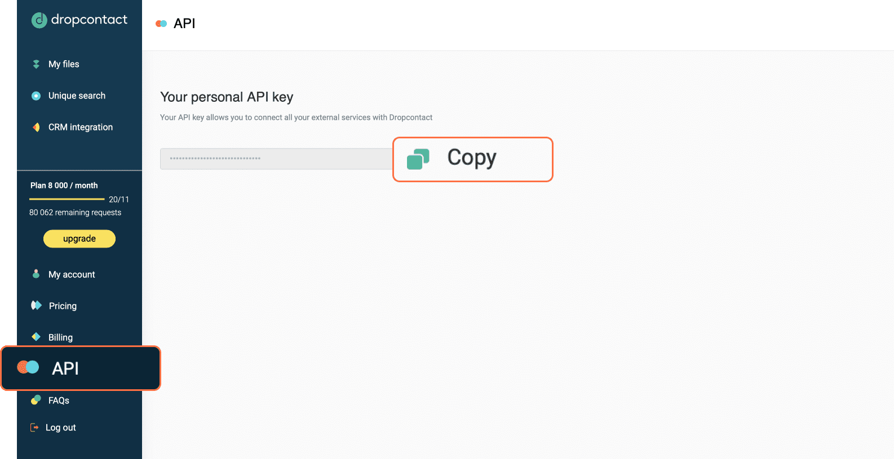

# Dropcontact

You can use these credentials to authenticate the following nodes with Dropcontact.
- [Dropcontact](../../nodes-library/nodes/Dropcontact/README.md)

## Prerequisites

Create an account on a [Dropcontact](https://www.dropcontact.com/) app.

## Using API Key

1. Open your Dropcontact [dashboard](https://app.dropcontact.io/app/).
2. Select ***API*** from the left sidebar. 
3. Click on the ***Copy*** button to copy the API key.
4. Paste the API key in the ***API Key*** field in the 'Credential for Dropcontact API' fields in n8n.
5. Click on the ***Save*** button to create your credentials.

