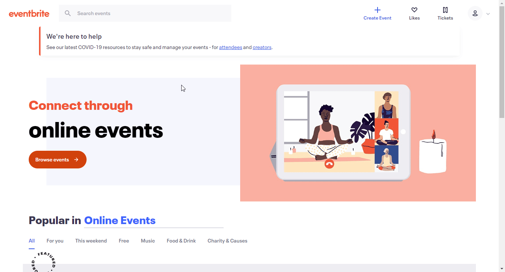

# Eventbrite

You can find information about the operations supported by the Eventbrite node on the [integrations](https://n8n.io/integrations/n8n-nodes-base.eventbrite) page. You can also browse the source code of the node on [GitHub](https://github.com/n8n-io/n8n/tree/master/packages/nodes-base/nodes/Eventbrite).

## Prerequisites

Create a [Eventbrite](https://www.eventbrite.com/) account.

## Using Access Token

1. Log in to your Eventbrite account.
2. Visit [your API keys page](https://www.eventbrite.com/platform/api-keys).
3. Copy your private token.
4. Use provided key with your Eventbrite node credentials in n8n.

## Using OAuth

1. Log in to your Eventbrite account.
2. Click on the user icon in the top right.
3. Select Account Settings in the drop down menu.
4. Click on Developer links > API keys in the sidebar.
5. Click on the *Create API Key* button.
6. Copy the 'OAuth Callback URL' provided in the Eventbrite OAuth API credentials in n8n and paste it in the 'OAuth Redirect URI' field in the Eventbrite API creation page.
7. Fill out any other information that is necessary and click 'Create Key'.
8. Find your API key in the 'API Keys' page and click on 'Show API key, client secret and tokens'.
9. Click on 'Show API key, client secret and tokens' and use the 'API key' and the 'Client secret' with your Eventbrite OAuth API credentials in n8n.
10. Click on the circle button in the OAuth section to connect an Eventbrite account to n8n.
11. Click the *Save* button to save your credentials.

