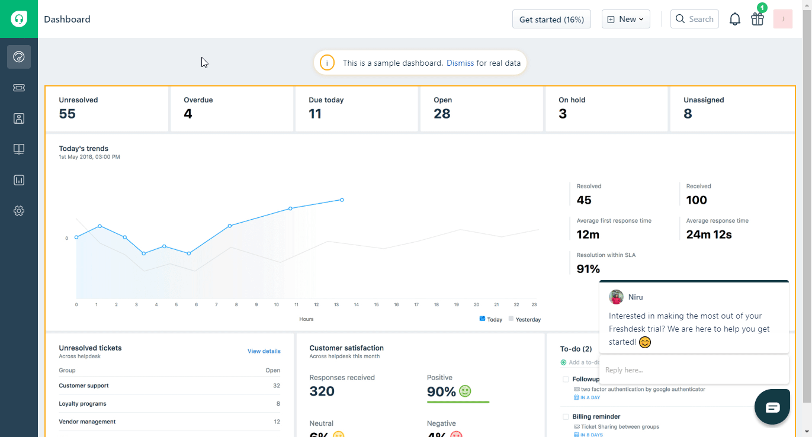

# Freshdesk

You can find information about the operations supported by the Freshdesk node on the [integrations](https://n8n.io/integrations/n8n-nodes-base.freshdesk) page. You can also browse the source code of the node on [GitHub](https://github.com/n8n-io/n8n/tree/master/packages/nodes-base/nodes/Freshdesk).

## Prerequisites

Create a [Freshdesk](https://freshdesk.com/) account.

## Using Access Token

1. Access your Freshdesk dashboard.
2. Click on your Organisation icon in the top right.
3. Click on Profile Settings.
4. Find your API key on the right panel.
5. Use provided API key and your subdomain (i.e n8n) with your Freshdesk node credentials in n8n.

