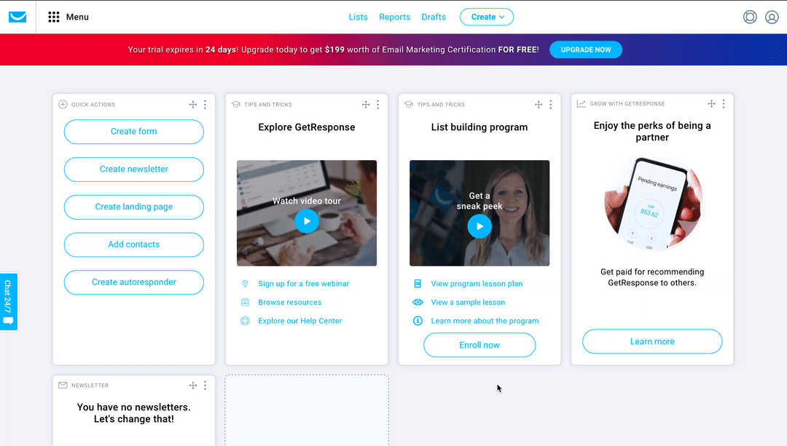
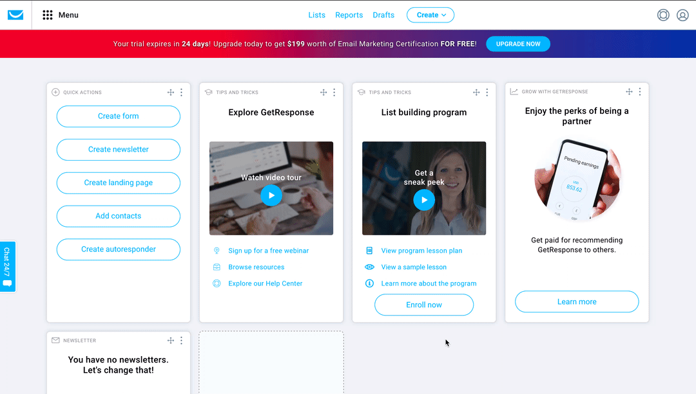

# GetResponse

You can use these credentials to authenticate the following nodes with GetResponse.
- [GetResponse](../../nodes-library/nodes/GetResponse/README.md)

## Prerequisites

Create a [GetResponse](https://www.getresponse.com/) account.

## Using OAuth

**Note:** The Redirect URL should be a URL in your domain, for example, `https://mytemplatemaker.example.com/gr_callback`. GetResponse doesn't accept the localhost callback  URL, for example, `http://localhost:5678/rest/oauth2-credential/callback`.

1. Access your [GetResponse dashboard](https://app.getresponse.com/dashboard).
2. Click on ***Menu*** and select 'Integrations and API'.
3. Click on the ***Custom apps*** tab.
4. Click on the ***Register your app*** button.
5. Enter all the necessary information.
6. Copy your OAuth Callback URL from the 'Create New Credentials' screen in n8n and paste it in the ***Redirect URL*** field.
7. Click on the ***Add*** button.
8. Use the provided ***Client ID*** and ***Client secret key*** with your GetResponse OAuth2 API credentials in n8n.
9. Click on the circle button in the OAuth section to connect a GetResponse account to n8n.
10. Click on the ***Save*** button to save your credentials in n8n.

## Using API Key

1. Access your [GetResponse dashboard](https://app.getresponse.com/dashboard).
2. Click on ***Menu*** and select 'Integrations and API'.
3. Click on the ***API*** tab.
4. Click on the ***Generate API key*** button.
5. Enter a name for your key.
6. Click on the ***Generate*** button.
7. Copy the ***API key*** that is displayed and use it with your GetResponse node credentials in n8n.

## Further Reference

- [OAuth 2.0 - Authorization Code](https://apidocs.getresponse.com/v3/case-study/oauth2-authorization-code)
- [Authentication - API key](https://apireference.getresponse.com/#section/Authentication)