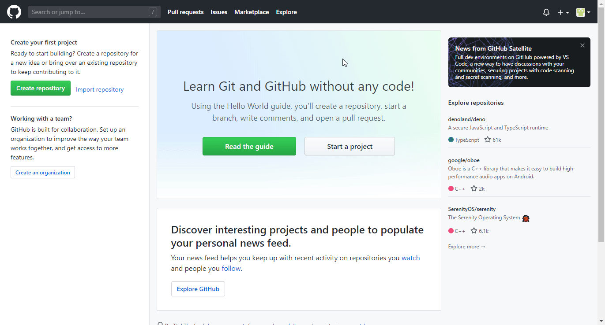

# GitHub

You can find information about the operations supported by the GitHub node on the [integrations](https://n8n.io/integrations/n8n-nodes-base.github) page. You can also browse the source code of the node on [GitHub](https://github.com/n8n-io/n8n/tree/master/packages/nodes-base/nodes/Github).

## Prerequisites

Create a [GitHub](https://github.com/) account.

## Using OAuth

1. Access your GitHub dashboard.
2. Click on your user icon in the top right.
3. Click on ***Settings***.
4. Click on ***Developer Settings***.
5. Select ***OAuth Apps***.
6. Click on ***Register a new application*** button.
7. Enter the ***Application Name*** and ***Homepage URL***.
8. Copy and paste the ***OAuth Callback URL*** from n8n in the ***Authorization callback URL*** field.
9. Use the provided ***Client ID*** and ***Client Secret*** with your GitHub node credentials in n8n.
10. Click on the circle button in the OAuth section to connect a GitHub account to n8n.
11. Click the ***Save*** button to save your credentials in n8n.

## Using Access Token

1. Access your GitHub dashboard.
2. Click on your user icon in the top right.
3. Click on ***Settings***.
4. Click on ***Developer Settings***.
5. Select ***Personal access tokens***.
6. Click on ***Generate new token***.
7. Select the relevant scope form the ***Select scopes*** section.
8. Use the provided credentials with your GitHub node credentials in n8n.
9. Click the ***Save*** button to save your credentials in n8n.

