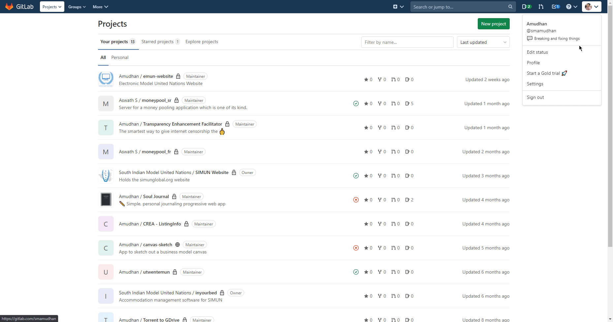

# Gitlab

You can find information about the operations supported by the Gitlab node on the [integrations](https://n8n.io/integrations/n8n-nodes-base.gitlab) page. You can also browse the source code of the node on [GitHub](https://github.com/n8n-io/n8n/tree/master/packages/nodes-base/nodes/Gitlab).

## Prerequisites

Create a [Gitlab](https://gitlab.com/) account.

### Using Access Token

1. Access your Gitlab dashboard.
2. Click on your user icon in the top right.
3. Click on Settings.
4. Click on Access tokens.
5. Fill out the required information to receive access token.
6. Use provided credentials with your Gitlab node credentials in n8n.

