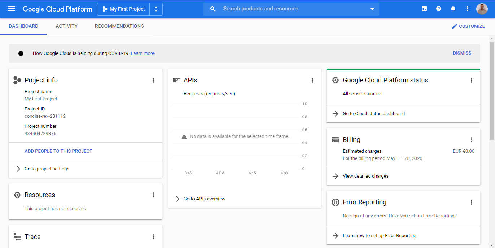

# Google

You can use these credentials to authenticate the following nodes with Google.
- [G Suite Admin](../../nodes-library/nodes/GSuiteAdmin/README.md)
- [Gmail](../../nodes-library/nodes/Gmail/README.md)
- [Google Calendar](../../nodes-library/nodes/GoogleCalendar/README.md)
- [Google Drive](../../nodes-library/nodes/GoogleDrive/README.md)
- [Google Sheets](../../nodes-library/nodes/GoogleSheets/README.md)
- [Google Tasks](../../nodes-library/nodes/GoogleTasks/README.md)
- [Google Translate](../../nodes-library/nodes/GoogleTranslate/README.md)
- [YouTube](../../nodes-library/nodes/YouTube/README.md)

## Prerequisites

Create a [Google Cloud](https://cloud.google.com/) account.

<!-- ### API Key

1. Access your Google dashboard.
2. Click on your user icon on the top left.
3. Click on API & Services.
4. Click on Credentials.
5. Click on Create Credentials.
6. Click on API Key.
7. Use provided API Key with your Google node credentials in n8n.
  -->

## Using OAuth

1. Access your [Google Cloud Console](https://console.cloud.google.com).
2. Click on the hamburger menu on the top left.
3. Click on API & Services.
4. Click on Credentials.
5. Click on Create Credentials.
6. Select OAuth client ID.
7. Select 'Web application' as the Application type.
8. Click on the Add URL button under the 'Authorized redirect URIs' section.
9. Copy your OAuth Callback URL from the 'Create New Credentials screen' in n8n and paste it there.
10. Click on the Create button in the Google cloud console.
11. Use provided Client Secret and Client ID with your Google node credentials in n8n.
12. While still in n8n, click on the Connect button in the OAuth section, and once the connection is complete, click on the Create button.
13. Now, go back to the Google cloud console and click on Library in the menu on the left.
14. Search for the API that you want to enable. For example, search for 'Calendar', and click on 'Google Calendar API'.
15. Click on the *Enable* button.

## Using Service Account

1. Access your [Google Cloud Console](https://console.cloud.google.com).
2. Click on the hamburger menu on the top left.
3. Click on API & Services.
4. Click on Credentials.
5. Click on Create Credentials.
6. Click on Service Account.
7. Choose your preferences.
8. Fill out information for your service account.
9. You will receive a `.json` file with your credentials.
10.  Use the values of client_email and private_key for your Google Credentials in the n8n node.
11.  Before entering the private_key in n8n, make sure that you replace all the `\n` with new lines.

