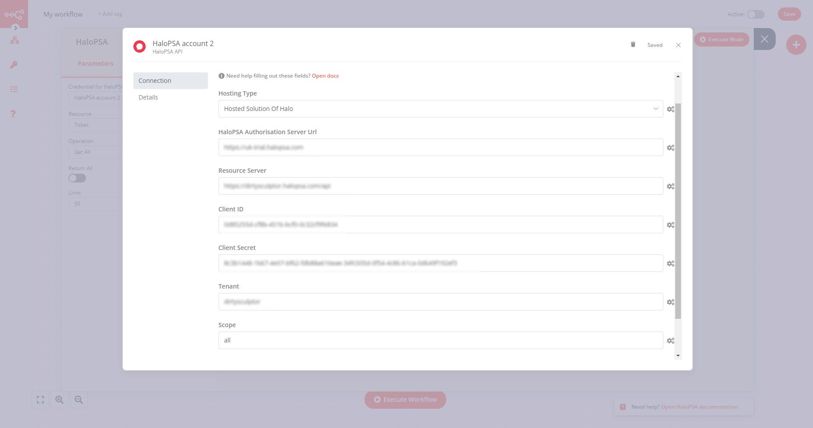

# HaloPSA

You can use these credentials to authenticate the following nodes with HaloPSA.
- [HaloPSA](../../nodes-library/nodes/HaloPSA/README.md)

## Prerequisites

Create a [HaloPSA](https://halopsa.com/) account.

## Allow your application to use the API:

1. Access your HaloPSA dashboard.
2. Click on Configuration on the left panel.
3. Under Integrations menu entry click on 'HaloPSA API'
4. Under 'API Details' you will get 'Resource Server', 'Authorisation Server', 'and Tenant'
5. Under 'Applications' click on 'View Applications' button
6. Click on 'new' button or click on existing app and then click on 'edit' button
7. Under 'Authentication Method' choose 'Client ID and Secret (Services)'
8. You will get 'Client ID' and 'Client Secret', copy Client Secret somewhere, it will not be displayed second time, if you loose this secret key you will need to regenerate new one
9. Select 'Login Type' and 'Agent to log in as'
10. Under 'Permissions' tab choose 'all' and click 'Save' button
11. In n8n HaloPSA credential screen you need to fill fields with received data, 'Tennant' field will be accessible only when 'Hosted Solution of Halo' is chosen

