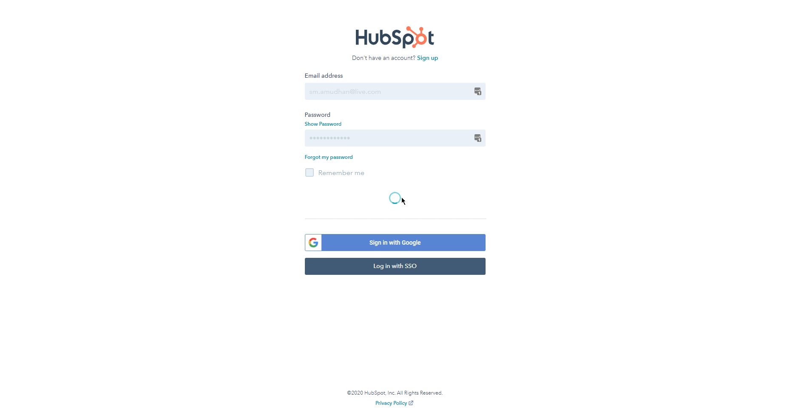
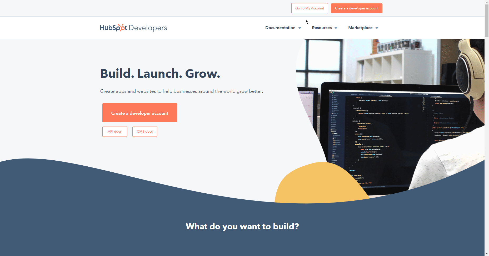

# HubSpot

You can use these credentials to authenticate the following nodes with HubSpot.
- [HubSpot](../../nodes-library/nodes/HubSpot/README.md)
- [HubSpot Trigger](../../nodes-library/trigger-nodes/HubSpotTrigger/README.md)

## Prerequisites

Create a [HubSpot](https://www.hubspot.com/) account.

## Using OAuth

::: tip ⛅️ Note for n8n.cloud users
You'll only need to enter the Credentials Name and click on the circle button in the OAuth section to connect your HubSpot account to n8n.
:::

1. Access your [HubSpot Developer Home](https://developers.hubspot.com/).
2. Click on the ***Manage apps*** button.
3. Click on the ***Create app*** button in the top right.
4. Specify an app name in the ***Public app name*** field.
5. Click on the 'Auth' tab.
6. Use the provided ***Client ID*** and the ***Client secret*** with your HubSpot OAuth2 API credentials in n8n.
7. If you are using the [HubSpot Trigger](../../nodes-library/trigger-nodes/HubSpotTrigger/README.md) node, copy the ***App ID*** along with the information in the previous step.
8. Copy your OAuth Callback URL from the 'Create New Credentials' screen in n8n and paste in the ***Redirect URL*** section.
9. In the Scopes section, make sure that the 'Basic OAuth functionality' scope is selected from the ***Add a required scope*** dropdown list.
10. Select any other Scopes you plan to use with n8n.
11. Click on the ***Save*** button to save your settings in HubSpot.
12. Back in n8n, click on the circle button in the OAuth section to connect your HubSpot account to n8n.
13. Click the ***Save*** button to save your credentials.

## Using Access Token

1. Access your HubSpot dashboard.
2. Click on the gear icon on the top right.
3. Click on ***Integrations*** and then ***API key***.
4. Click on the ***Create key*** button.
5. Use the key with HubSpot node credentials in n8n.

## Using Developer API Key (for HubSpot Trigger node)

1. Access your [HubSpot Developer Home](https://developers.hubspot.com/).
2. Click on 'Apps' in the top bar.
3. Click on the ***Get HubSpot API key*** button.
4. Click on the ***Show key*** button.
5. Use the displayed Developer API key with your HubSpot Trigger node credentials in n8n.

