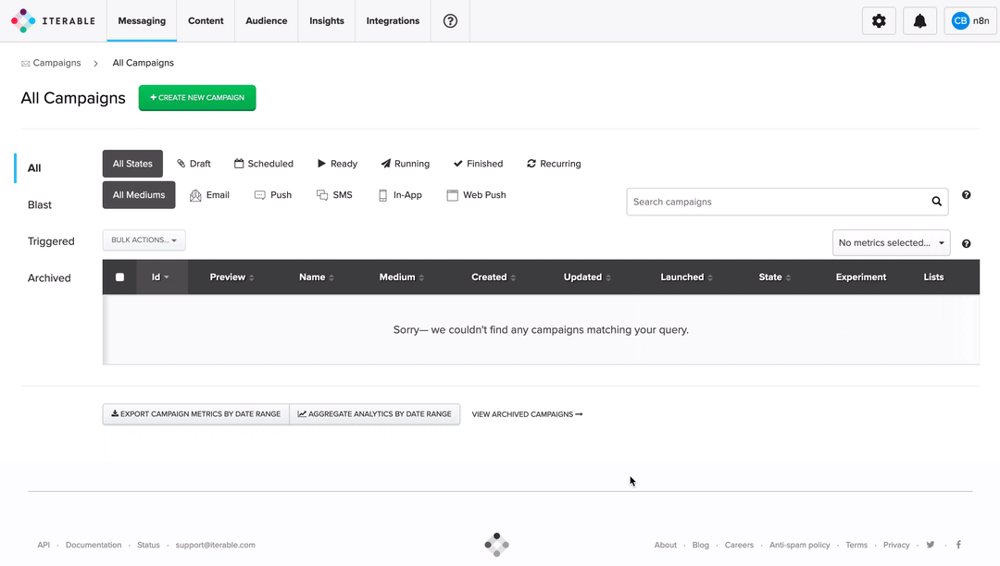

# Iterable

You can use these credentials to authenticate the following nodes with Iterable.
- [Iterable](../../nodes-library/nodes/Iterable/README.md)

## Prerequisites

Create an [Iterable](https://iterable.com) account.

## Using API Key

1. Access the [Iterable dashboard](https://app.iterable.com/).
2. Click on ***Integrations*** and select 'API keys'.
3. Click on the ***NEW API KEY*** button.
4. Enter a name in the ***Name*** field.
5. Click on the ***Create*** button.
6. Click on the ***Copy*** button to copy the API key.
7. Use this ***API key*** with your Iterable node credentials in n8n.

