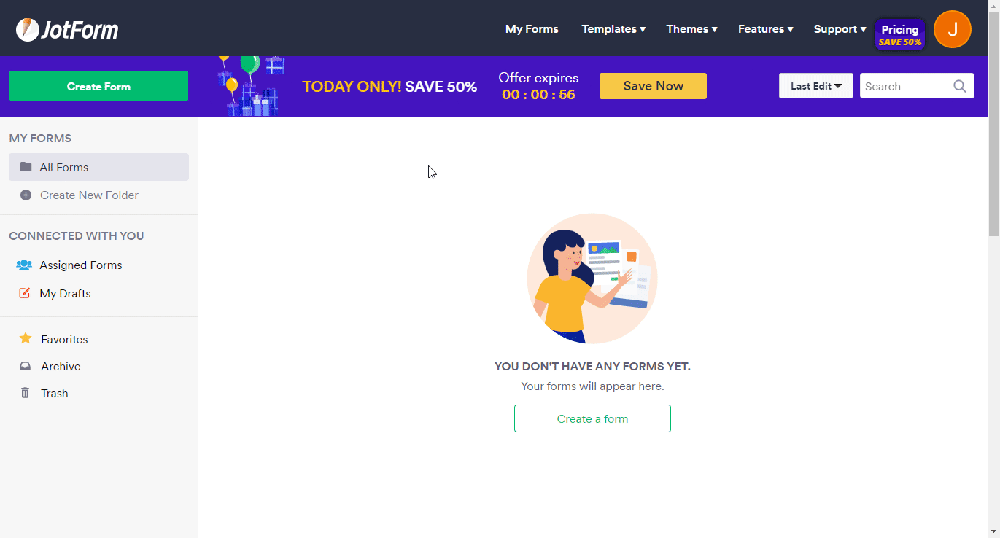

# JotForm
You can find information about the operations supported by the JotForm node on the [integrations](https://n8n.io/integrations/n8n-nodes-base.invoiceNinja) page. You can also browse the source code of the node on [JotForm](https://github.com/n8n-io/n8n/tree/master/packages/nodes-base/nodes/JotForm).

## Pre-requisites

Create a [JotForm](https://www.jotform.com/) account.

## Using Access Token

1. Access your JotForm dashboard.
2. Click on the user icon in the top right.
3. Click on Settings.
4. Click on the API tab on the left.
5. Create new key.
6. Use the key with JotForm node credentials in n8n.

