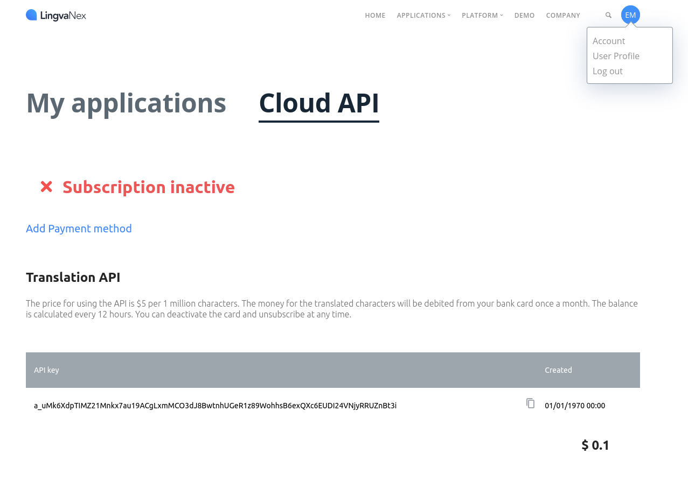

# LingvaNex

You can use these credentials to authenticate the following nodes with LingvaNex.
- [LingvaNex](../../nodes-library/nodes/LingvaNex/README.md)

## Prerequisites

Create a [LingvaNex](https://lingvaNex.com) account.

## Using API

1. Go to your [LingvaNex Account](https://lingvanex.com/account/).
2. Select ***Cloud API***.
3. Click on ***Payment / Subscription***. Note that you can use the limited Translation API without having to subscribe or add a payment method. 
4. Use the generated ***API Key*** with your LingavaNex node credentials in n8n.

