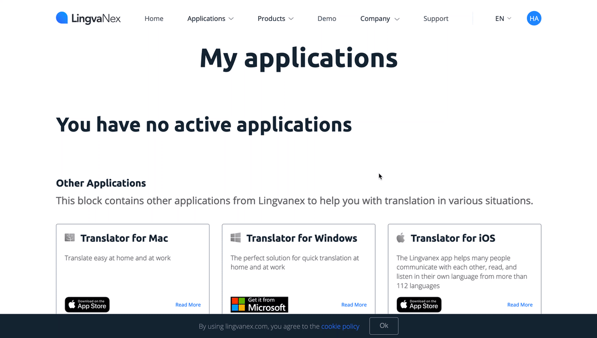

# LingvaNex

You can use these credentials to authenticate the following nodes with LingvaNex.
- [LingvaNex](../../nodes-library/nodes/LingvaNex/README.md)

## Prerequisites

Create a [LingvaNex](https://lingvaNex.com) account.

## Using API

1. Access your [LingvaNex user control panel](https://lingvanex.com/account/) page.
2. Scroll to the ***API*** section at bottom of the page.
3. Click on the ***Generate Key*** button.
4. Enter a title in the ***Title*** field.
5. Click on the ***Create*** button.
6. Use the ***API Key*** with your LingavaNex node credentials in n8n.

