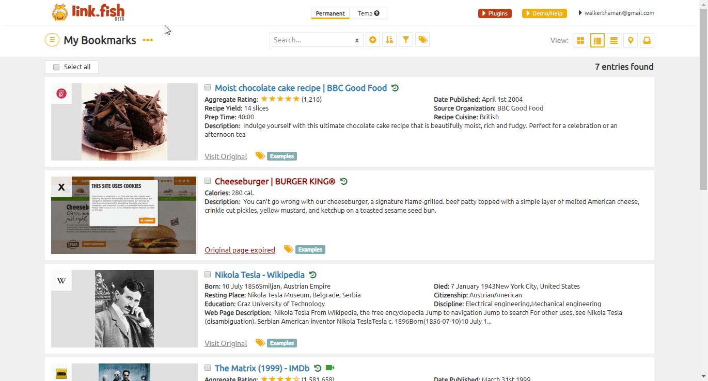

# LinkFish
You can find information about the operations supported by the LinkFish node on the [integrations](https://n8n.io/integrations/n8n-nodes-base.linkFish) page. You can also browse the source code of the node on [LinkFish](https://github.com/n8n-io/n8n/tree/master/packages/nodes-base/nodes/LinkFish).

## Pre-requisites

Create a [LinkFish](https://www.linkfish.com/) account.

## Using Access Token

1. Access your LinkFish dashboard.
2. Click on the plugins button at the top.
3. Click on API Dashboard.
4. Create new API key.
5. Use your email and the API key with LinkFish node credentials in n8n.

