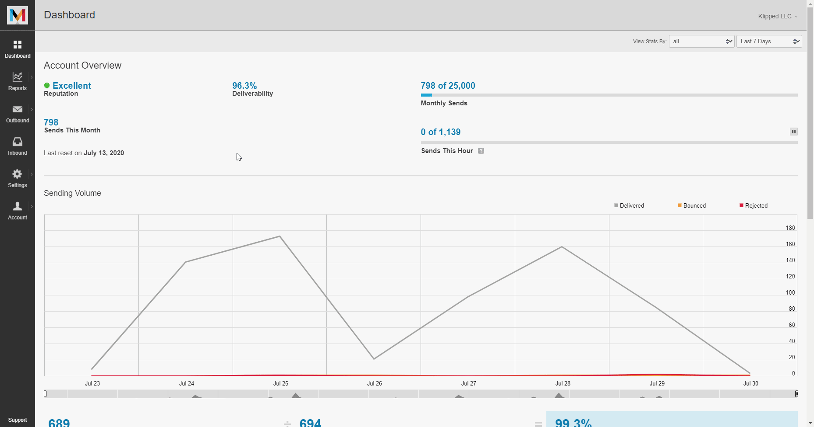

# Mandrill

You can find information about the operations supported by the Mandrill node on the [integrations](https://n8n.io/integrations/n8n-nodes-base.mandrill) page. You can also browse the source code of the node on [GitHub](https://github.com/n8n-io/n8n/tree/master/packages/nodes-base/nodes/Mandrill).

## Prerequisites

Create a [Mandrill](https://mandrillapp.com/login/) account.

## Using Access Token

1. Access your Mandrill dashboard.
2. Click on the Settings icon in the sidebar.
3. Click on the *+ New API Key* button and create a new API Key.
4. Use the key with your Mandrill API credentials in n8n.

