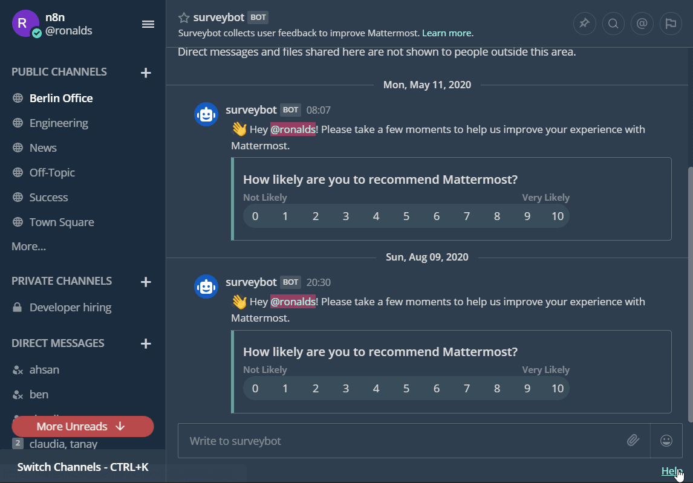
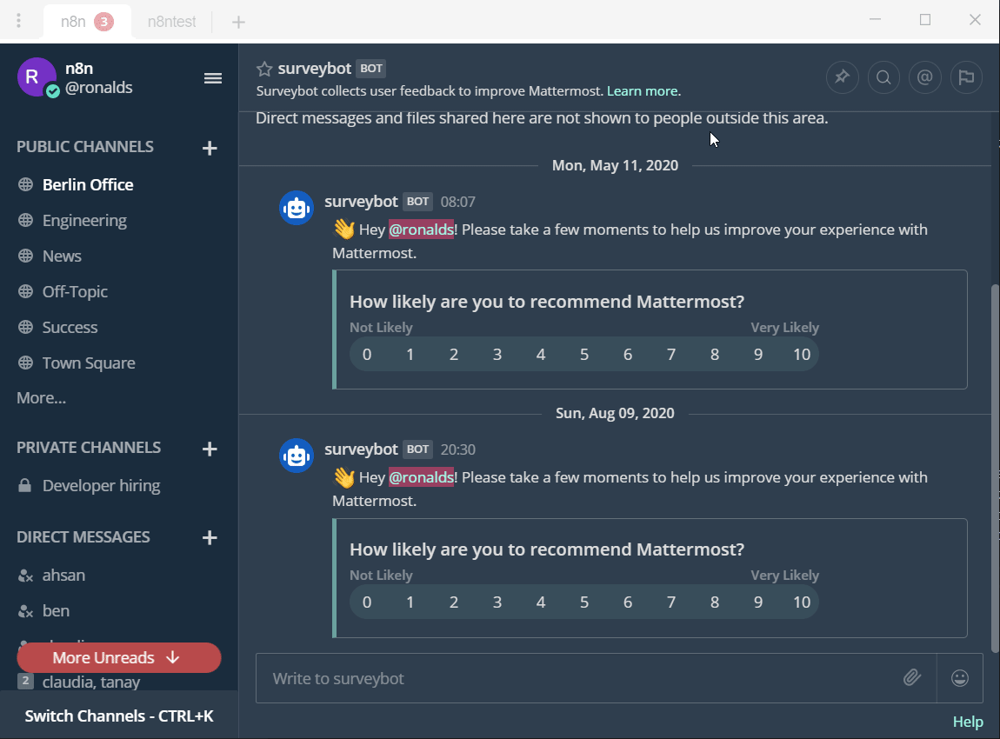

# Mattermost

You can find information about the operations supported by the Mattermost node on the [integrations](https://n8n.io/integrations/n8n-nodes-base.mattermost) page. You can also browse the source code of the node on [GitHub](https://github.com/n8n-io/n8n/tree/master/packages/nodes-base/nodes/Mattermost).

## Prerequisites

- Create a [Mattermost](https://www.mattermost.com/) account.
- Have the rights to generate personal access tokens (needs to be enabled by the system administrator of the Mattermost server).

## Using Access Token
1. Access your System Console.
2. Access Integrations.
3. Go to Integration Management.
4. Scroll down and enable personal access tokens.

5. Personal access tokens are generated for individual users, so they must be enabled for each user. To accomplish this, go to Users under User Management. *You may also create a bot account and apply the same to this.*
6. Select the user you wish to enable them for. Click on "Manage Roles" under the dropdown menu.
7. Tick the "Allow this account to generate personal access tokens" radio button.
8. Now the user can generate a personal access token by going to account settings.
9. Click on the security tab.
10. Click edit on the personal access token item and click generate token.

