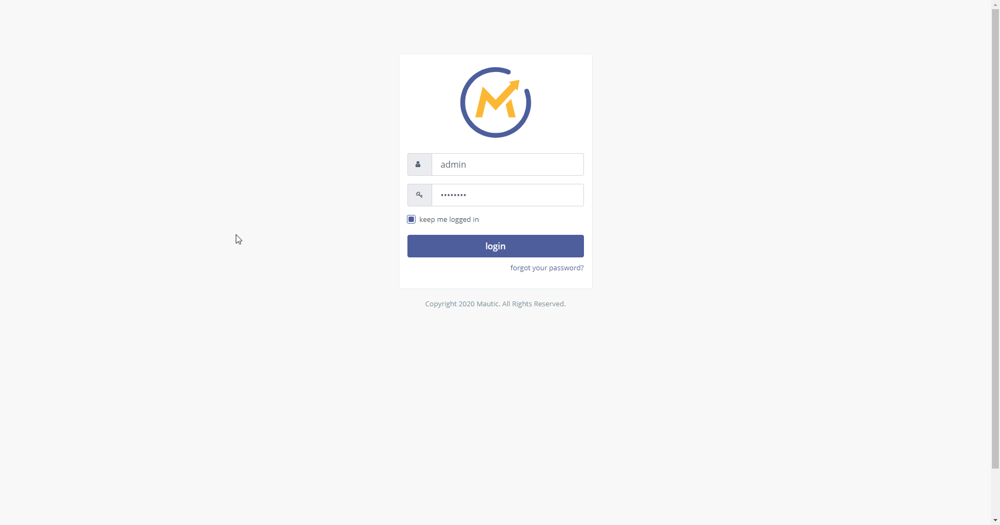

# Mautic

You can find information about the operations supported by the Mautic node on the [integrations](https://n8n.io/integrations/n8n-nodes-base.mautic) page. You can also browse the source code of the node on [GitHub](https://github.com/n8n-io/n8n/tree/master/packages/nodes-base/nodes/Mautic).

## Prerequisites

Create an account on a [Mautic](https://www.mautic.org/) instance.

## Using OAuth

1. Log in to your Mautic account.
2. Click on the gear icon in the top right.
3. Select 'API Credentials' in the drop down menu.
4. Click on the 'New' button.
5. Select the 'OAuth 2' option from the *Authorization Protocol* dropdown list.
6. Copy the 'OAuth Callback URL' provided in the Mautic OAuth2 API credentials in n8n and paste it in the 'Redirect URI' field in the Mautic credential page.
7. Fill out any other necessary information and click 'Apply'.
8. Click the *Save & Close* button to save your credentials in Mautic.
9. Use the displayed 'Client ID' and the 'Client Secret' with your Mautic OAuth API credentials in n8n.
10. Click on the circle button in the OAuth section to connect a Mautic account to n8n.
11. Click the *Save* button to save your credentials in n8n.

## Using Credentials

Use your Mautic username and password as the Mautic API node credentials in n8n.
