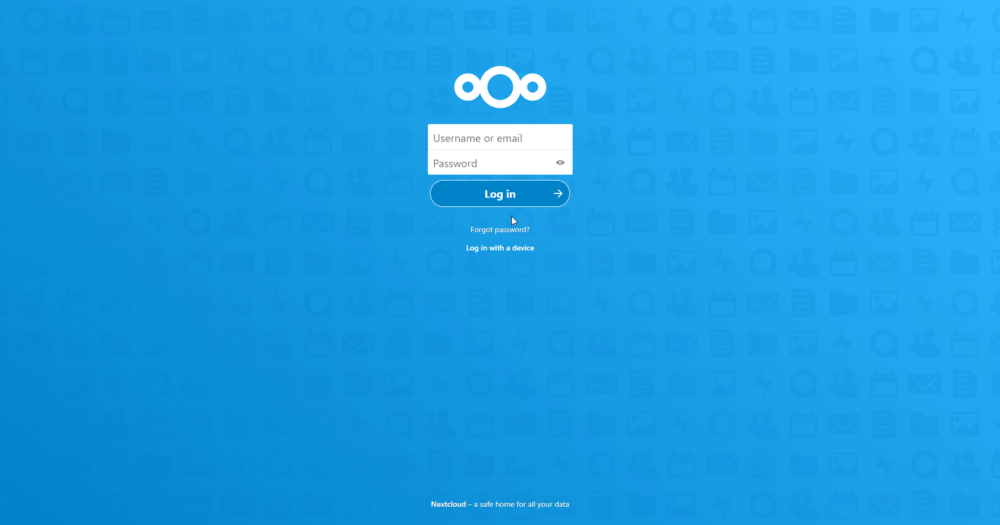

# Nextcloud

You can find information about the operations supported by the Nextcloud node on the [integrations](https://n8n.io/integrations/n8n-nodes-base.nextCloud) page. You can also browse the source code of the node on [GitHub](https://github.com/n8n-io/n8n/tree/master/packages/nodes-base/nodes/NextCloud).

## Prerequisites

Create a [Nextcloud](https://nextcloud.com/) account.

## Using OAuth

1. Log in to your Nextcloud account.
2. Click on the user icon in the top right.
3. Select 'Settings' in the drop down menu.
4. Click on 'Security' under Administration in the sidebar.
5. Copy the 'OAuth Callback URL' provided in the NextCloud OAuth2 API credentials in n8n and paste it in the *Redirection URI* field under the 'OAuth 2.0 clients' section in the Nextcloud page.
6. Fill out any other information that is necessary and click on the 'Add' button.
7. Click on the eye icon to reveal the Secret and use the 'Client Identifier' and the 'Secret' with your Nextcloud OAuth2 API credentials in n8n.
8. Replace your domain in the samples for the *Authorization URL* and *Access Token URL* fields.
9. Enter your [Web DAV URL](https://docs.nextcloud.com/server/15/user_manual/files/access_webdav.html) in the *Web DAV URL* field.
10. Click on the circle button in the OAuth section to connect a Nextcloud account to n8n.
11. Click the *Save* button to save your credentials.

## Using Username and Password

Use your [Web DAV URL](https://docs.nextcloud.com/server/15/user_manual/files/access_webdav.html) along with your Nextcloud username and password in the node credentials.
