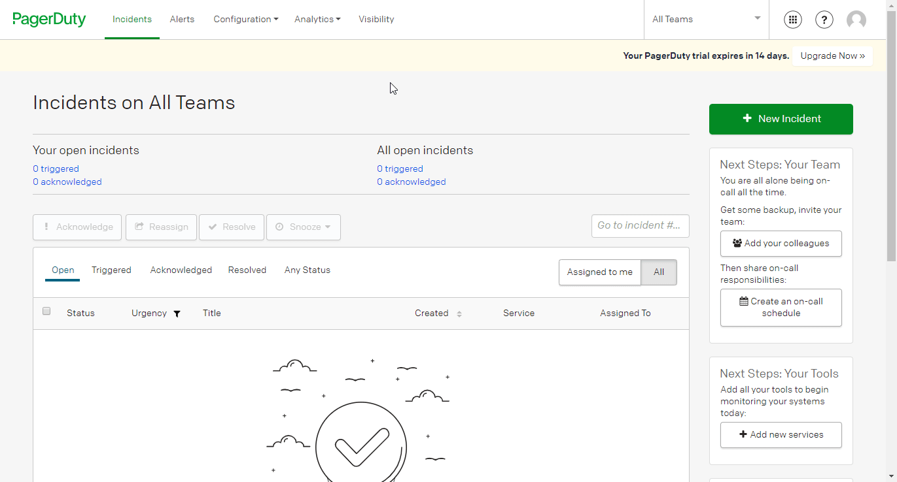

# PagerDuty

You can find information about the operations supported by the PagerDuty node on the [integrations](https://n8n.io/integrations/n8n-nodes-base.pagerDuty) page. You can also browse the source code of the node on [GitHub](https://github.com/n8n-io/n8n/tree/master/packages/nodes-base/nodes/PagerDuty).

## Prerequisites

Create a [PagerDuty](https://pagerduty.com/) account.

## Using OAuth

1. Access your PagerDuty dashboard.
2. Select 'Developer Mode' from the number pad icon in the top right.
3. Click on the ***Create New App*** button.
4. Enter a name in the ***App Name*** field, and a description in the ***Brief Description*** field.
5. Select 'Infrastructure Automation' from the ***Category*** dropdown list.
6. Choose the appropriate option for the publication of your app and click on the ***Save*** button.
7. Click on the ***Add*** button in the 'OAuth 2.0' section.
8. Copy the 'OAuth Callback URL' provided in the 'PagerDuty OAuth2 API' credentials in n8n and paste it in the ***Redirect URL*** field in the PagerDuty app creation page.
9. Use the provided ***Client ID*** and ***Client Secret*** with your PagerDuty OAuth2 API credentials in n8n.
10. Select 'Read/Write' from the ***Set Permission Scopes*** dropdown list and then click on ***Save***.
11. Click on the circle button in the OAuth section of n8n to connect a PagerDuty account to n8n.
12. Click on the ***Save*** button to save your credentials.

## Using Access Token

1. Access your PagerDuty dashboard.
2. Click on configuration.
3. Click on API access.
4. Create a new API key.
5. Use this API key with your PagerDuty node credentials in n8n.

