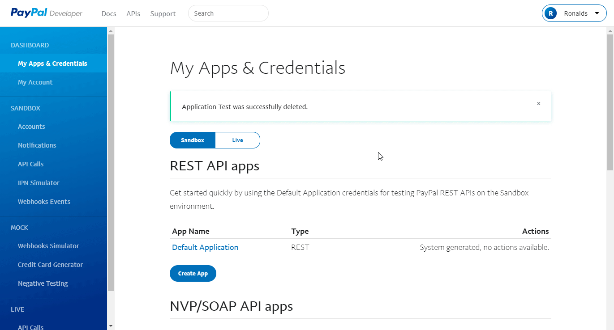

# PayPal

You can use these credentials to authenticate the following nodes with PayPal.
- [PayPal](../../nodes-library/nodes/PayPal/README.md)
- [PayPal Trigger](../../nodes-library/trigger-nodes/PayPalTrigger/README.md)

## Prerequisites

Create a [PayPal](https://paypal.com/) account.

## Using OAuth

1. Access your [PayPal dashboard](https://developer.paypal.com/developer/applications/).
2. Click on *Log in to Dashboard*.
3. Enter your PayPal account credentials.
4. In the section 'REST API apps', click on *Create app*.
5. Enter a name for your app in *App Name* and click on *Create App*.
6. Return to n8n and enter the Client ID and Client Secret in your PayPal API credentials.
7. Choose the environment: sandbox or live.

