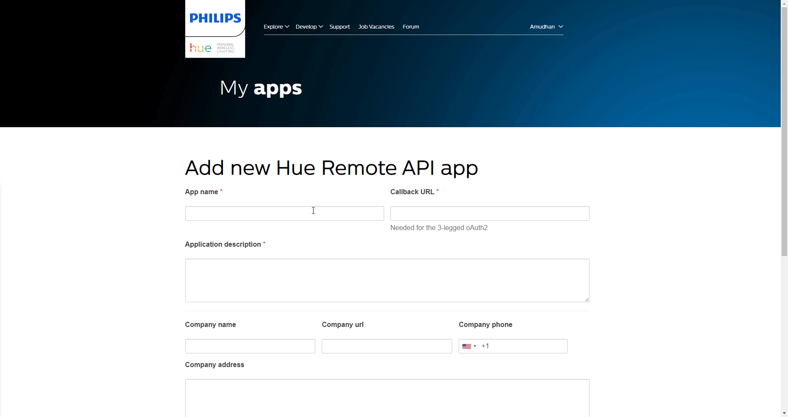

# Philips Hue

You can use these credentials to authenticate the following nodes with Philips Hue.
- [Philips Hue](../../nodes-library/nodes/PhilipsHue/README.md)

## Prerequisites

Create a [Philips Hue Developer](https://developers.meethue.com/) account.

## Using OAuth

1. Access the [Add new Hue Remote API app](https://developers.meethue.com/add-new-hue-remote-api-app/) page.
2. Enter a name in the ***App name*** field.
3. Enter a description in the ***Application description*** field.
4. Copy the 'OAuth Callback URL' provided in the Philips Hue OAuth2 API credentials in n8n and paste it in the ***Callback URL*** field in the *Add new Hue Remote API app* page.
5. Click on the ***Submit*** button.
6. Click on the ***AppId*** to reveal the credentials.
7. Use the displayed ***AppId***, ***ClientId*** and the ***ClientSecret*** with your Philips Hue OAuth2 API credentials in n8n.
8. Click on the circle button in the OAuth section to connect a Philips Hue account to n8n.
9. Click the ***Save*** button to save your credentials in n8n.

